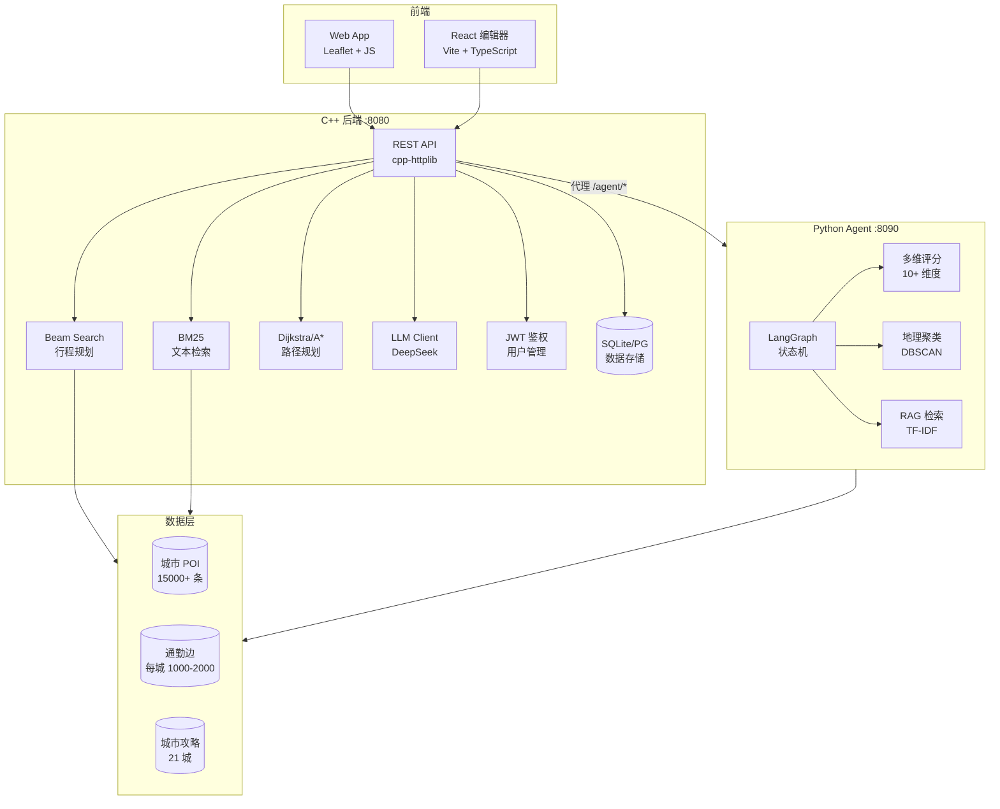

# Tour Pass

> **线上演示**：https://tour-pass.onrender.com

C++17 + Python 双引擎城市旅行行程规划服务。后端基于 **15000+ 真实高德 POI** 和 **21 城市数据集**，通过 Dijkstra/A* 最短路、Beam Search 时间槽规划、BM25 文本检索、Pareto 多目标排序生成多候选多日行程。内置 **AI Agent 规划引擎**（LangGraph + LLM），支持自然语言对话式行程规划。前端提供 React 行程编辑器，集成高德地图可视化、拖拽排序、多日时间线、PDF 导出等功能。已部署至 Render，支持 Docker 一键构建。

## 核心能力

### C++ 规划引擎

- **Beam Search 行程生成**：在上午/午餐/下午/晚餐/晚上时间槽中保留 Top-K 状态，综合评分、通勤和时间窗约束规划路线
- **5 种策略候选**：少走路、紧凑、文化优先、美食优先、雨天室内，Pareto 非支配排序量化取舍
- **TravelTimeProvider**：可插拔通勤时间数据源，支持本地 edges.json 和高德实时路线 API 无缝切换
- **严格时间窗校验**：开放时间、餐饮窗口、站点顺序、当天结束时间
- **BM25 文本检索**：字段权重 + 匹配词解释
- **用户认证**：注册/登录、邮箱验证码、JWT 鉴权、角色权限（admin/user/guest）、查询配额控制
- **异步任务**：`POST /trip/jobs` 提交异步规划任务，轮询获取结果，支持队列管理和历史查询

### AI Agent 规划引擎

- **LangGraph + LLM**：Python Agent 服务（端口 8090），基于 DeepSeek-V3 的中央规划 Agent
- **Hybrid AI 架构**：用户自然语言 → LLM 意图抽取 → RAG 上下文检索 → POI/酒店搜索 → 酒店锚点选择 → 每日规划 → Beam Search 路线优化 → 自然语言生成
- **轻量级 RAG**：TF-IDF 向量检索，零 ML 依赖，支持城市攻略和 POI 描述的语义匹配
- **多维评分引擎**：10+ 维度评分（兴趣匹配、策略加权、必去加权、通勤惩罚、类型多样性、区域多样性、时间适配等）
- **地理聚类**：基于 DBSCAN 的景点区域聚类，优化每日路线的空间连贯性
- **推荐语优化**：6 种通用角度轮换（隐藏玩法、最佳时间、避坑指南、交通攻略、省钱技巧、本地人推荐），消除模板化内容

### React 行程编辑器

- **Wizard 引导流程**：选择城市 → 设置天数 → 选择酒店 → 细分行程段 → 生成行程 → 预览确认
- **拖拽排序**：基于 dnd-kit 的景点拖拽重排，支持跨天移动
- **高德地图集成**：实时路线渲染、起终点标记、酒店地图选点、POI 悬浮高亮
- **多日时间线**：可视化时间轴编辑，支持手动调整各站点时间
- **Command 模式**：完整的撤销/重做支持（添加/删除/重排/跨天移动/时间修改）
- **协作管理**：多人行程协作、冲突检测、权限管理
- **数据持久化**：LocalStorage 自动保存，支持导入/导出行程 JSON
- **PDF 导出**：生成行程 PDF 文档，包含路线详情和推荐理由
- **PWA 支持**：Service Worker 缓存，可离线访问
- **移动端适配**：响应式布局，移动端导航和触屏优化

### 前端可视化

- **Leaflet 地图**：每日路线 polyline + marker popup 展示站点详情
- **A* 路径查询**：最短路径结果地图绘制
- **多城市支持**：`TOURPASS_CITY` 选择加载不同城市数据集，已采集 21 城数据
- **热门行程推荐**：展示平台热门行程供参考

## 数据规模

- **21 城市**：共约 15000+ POI（景点 / 餐饮 / 酒店 / 交通 / 夜游）
- **通勤边**：每城市 1000-2000 条，高德真实路线占比 80%+
- **城市攻略**：每城配 guidebook.json，包含交通、美食、住宿、注意事项等结构化信息
- **推荐语质量**：模板化比例从 76.6% 降至 0%，93.5% 包含景点介绍+实用建议，平均 37 字
- 预置城市：长沙、武汉、北京、上海、广州、深圳、成都、重庆、杭州、南京、西安、青岛、厦门、苏州、昆明、大理、丽江、桂林、三亚、哈尔滨、张家界

## 环境要求

**本地开发（Windows）**：
- MinGW `g++` + `mingw32-make`，或 CMake 3.16+
- Node.js 18+（脚本和前端）
- Python 3.10+（Agent 服务）
- 可选：OpenSSL（仅在需要通过 CMake 直接请求 HTTPS LLM 接口时使用）

**Docker / 线上部署**：
- Docker（本地验证）
- Render / 任意支持 Docker 的 PaaS（线上部署）

## 常用命令

**C++ 后端**（Makefile 构建）：

```powershell
mingw32-make build       # 编译
mingw32-make test        # 运行测试
mingw32-make run         # 编译并启动服务
mingw32-make clean       # 清理构建产物
mingw32-make validate-data  # 数据质量校验
```

CMake 构建（默认跳过测试目标，适合 Docker 和生产环境）：

```powershell
cmake -S . -B build
cmake --build build
```

启用 CMake 测试目标：

```powershell
cmake -S . -B build -DTOURPASS_BUILD_TESTS=ON
cmake --build build
ctest --test-dir build
```

**Python Agent 服务**：

```powershell
pip install -r agent/requirements.txt
python -m agent.main        # 启动 Agent 服务（端口 8090）
```

**React 编辑器**（开发模式）：

```powershell
cd web/editor
npm install
npm run dev               # Vite 开发服务器
```

服务默认监听：

```text
http://127.0.0.1:8080      # C++ 后端
http://127.0.0.1:8090      # Agent 服务
http://127.0.0.1:5173      # 编辑器开发服务器
```

## 环境变量

### C++ 后端

| 变量 | 说明 | 默认值 |
|------|------|--------|
| `PORT` | 监听端口 | `8080` |
| `HOST` | 监听地址 | `127.0.0.1` |
| `TOURPASS_CITY` | 加载城市数据 | `changsha` |
| `TOURPASS_DB_PATH` | SQLite 数据库路径 | `storage/tourpass.sqlite` |
| `LLM_DISABLED` | 禁用 LLM（演示模式） | `0` |
| `OPENAI_API_KEY` | LLM API Key | - |
| `LLM_BASE_URL` | LLM API 地址 | `https://api.deepseek.com` |
| `LLM_MODEL` | LLM 模型名 | `deepseek-chat` |
| `TOURPASS_JWT_SECRET` | JWT 签名密钥 | - |
| `TOURPASS_API_KEY` | API 访问密钥 | - |
| `TOURPASS_AMAP_API_KEY` | 高德地图 API Key | - |
| `TOURPASS_WORKERS` | 工作线程数 | `4` |
| `TOURPASS_BEAM_WIDTH` | Beam Search 宽度 | `5` |
| `TOURPASS_DISTANCE_CACHE_MODE` | 距离缓存模式 | `auto` |
| `RESEND_API_KEY` | 邮件服务 API Key | - |
| `RESEND_FROM_EMAIL` | 发件人邮箱 | - |

### Agent 服务

| 变量 | 说明 | 默认值 |
|------|------|--------|
| `AGENT_PORT` | Agent 服务端口 | `8090` |
| `AGENT_BASE_URL` | Agent 服务地址 | `http://127.0.0.1:8090` |
| `DEEPSEEK_API_KEY` | DeepSeek API Key | - |

### 前端

| 变量 | 说明 | 默认值 |
|------|------|--------|
| `VITE_HOTEL_API_KEY` | 前端酒店服务 API Key | - |

LLM 配置：默认读取 `config/llm.local.json`，格式参考 `config/llm.example.json`。本地配置存在密钥时不会被单独残留的 `OPENAI_API_KEY` 覆盖。

## Docker 部署

```powershell
docker build -t tour-pass:local .
docker run --rm -p 8080:8080 -e LLM_DISABLED=1 tour-pass:local
node scripts/container_smoke.js http://127.0.0.1:8080
```

Docker 镜像默认 `LLM_DISABLED=1` 作为演示安全默认值。多阶段构建包含 C++ 后端和 Python Agent 服务。部署细节见 [docs/deployment.md](docs/deployment.md)。

## API 接口

### C++ 后端 API

```powershell
# 健康检查
curl.exe http://127.0.0.1:8080/health

# 自然语言行程规划（LLM）
curl.exe -X POST http://127.0.0.1:8080/trip/chat \
  -H "Content-Type: application/json; charset=utf-8" \
  --data-binary "@docs/sample_chat_request.json"

# 结构化行程规划
curl.exe -X POST http://127.0.0.1:8080/trip/plan \
  -H "Content-Type: application/json; charset=utf-8" \
  --data-binary "@docs/sample_trip_request.json"

# 异步行程规划
curl.exe -X POST http://127.0.0.1:8080/trip/jobs \
  -H "Content-Type: application/json" \
  -d "{\"city\":\"beijing\",\"days\":3}"

# 查询异步任务状态
curl.exe http://127.0.0.1:8080/trip/jobs/{job_id}

# 候选路线查询
curl.exe -X POST http://127.0.0.1:8080/trip/alternatives \
  -H "Content-Type: application/json" \
  -d "{\"city\":\"beijing\",\"days\":2}"

# 行程解释
curl.exe -X POST http://127.0.0.1:8080/itinerary/explain \
  -H "Content-Type: application/json" \
  -d "{\"city\":\"beijing\",\"days\":1}"

# POI 搜索
curl.exe "http://127.0.0.1:8080/poi/search?q=故宫&limit=3"

# 最短路径查询
curl.exe "http://127.0.0.1:8080/route/shortest?from=amap_d0197c46&to=amap_f3d362be"

# 城市列表
curl.exe http://127.0.0.1:8080/cities

# 服务指标
curl.exe http://127.0.0.1:8080/metrics

# 用户注册
curl.exe -X POST http://127.0.0.1:8080/auth/register \
  -H "Content-Type: application/json" \
  -d "{\"email\":\"user@example.com\",\"password\":\"pass123\"}"

# 用户登录
curl.exe -X POST http://127.0.0.1:8080/auth/login \
  -H "Content-Type: application/json" \
  -d "{\"email\":\"user@example.com\",\"password\":\"pass123\"}"
```

### Agent 代理 API

C++ 后端自动代理 `/agent/*` 请求到 Agent 服务：

```powershell
# Agent 健康检查
curl.exe http://127.0.0.1:8080/agent/health

# Agent 行程规划（同步）
curl.exe -X POST http://127.0.0.1:8080/agent/plan-sync \
  -H "Content-Type: application/json" \
  -d "{\"city\":\"beijing\",\"days\":3,\"preferences\":\"文化历史\"}"

# Agent 对话式规划
curl.exe -X POST http://127.0.0.1:8080/agent/chat \
  -H "Content-Type: application/json" \
  -d "{\"message\":\"我想去北京玩3天，喜欢历史文化\"}"
```

完整 API 文档见 [docs/openapi.yaml](docs/openapi.yaml)。

## CI 与质量保障

仓库提供 GitHub Actions 工作流 `.github/workflows/ci.yml`，在 PR 和 main push 时执行：
- Ubuntu/Windows CMake 构建与 CTest
- Windows 上启动服务运行核心 API 冒烟测试

本地验证：

```powershell
# 数据质量校验
mingw32-make validate-data

# API 冒烟测试
powershell -ExecutionPolicy Bypass -File scripts/api_smoke.ps1 -AppPath bin/tourpass.exe -Port 8091

# 性能基准测试
node scripts/benchmark.js --app bin/tourpass.exe --port 8092 --duration 60 --warmup 5 --concurrency-steps 1,10,50,100,200

# 算法质量检查
node scripts/algorithm_quality_check.js

# 数据验证
node scripts/validate_data.js
```

## 项目结构

```text
├── src/                    # C++ 后端源码（API、规划、搜索、图算法、LLM、存储）
├── include/tourpass/       # 头文件（数据模型、接口定义）
├── agent/                  # Python AI Agent 服务
│   ├── main.py             # Agent 服务入口（FastAPI + LangGraph）
│   ├── graph.py            # 主规划 pipeline（意图抽取→RAG→搜索→规划→优化）
│   ├── scorer.py           # 多维评分引擎（10+ 维度）
│   ├── clustering.py       # 地理聚类（DBSCAN）
│   ├── rag.py              # RAG 检索（TF-IDF）
│   ├── prompts.py          # LLM 提示词模板
│   └── tools.py            # POI/酒店搜索工具（含本地 JSON fallback）
├── third_party/            # 第三方库（httplib, json, sqlite3）
├── web/                    # 前端页面
│   ├── editor/             # React 行程编辑器（Vite + TypeScript + Tailwind）
│   │   ├── src/components/ # UI 组件（Wizard、地图、时间线、协作、分析）
│   │   ├── src/core/       # 核心逻辑（Command 模式、验证规则、服务）
│   │   └── src/stores/     # 状态管理（Zustand）
│   ├── app.js              # 主应用脚本（Leaflet 地图 + 行程渲染）
│   └── admin.js            # 管理页面
├── data/                   # 城市 POI、通勤边、攻略数据（21 城市）
├── config/                 # 配置文件（amap 城市配置、LLM 配置模板）
├── scripts/                # 数据采集、清洗、验证、推荐语优化脚本
├── tests/                  # C++ 单元测试 + Node 集成测试
├── docs/                   # OpenAPI 文档、部署说明
├── CMakeLists.txt          # CMake 构建配置
├── Makefile                # MinGW 构建配置
├── Dockerfile              # 多阶段 Docker 构建（含 Agent 服务）
└── render.yaml             # Render 部署配置（含 PostgreSQL）
```

## 技术架构



## 安全说明

- 密钥通过环境变量或 `config/llm.local.json`（已 gitignore）注入，代码中不硬编码
- `.gitignore` 已排除 `.claude/`、`.trae/`、`config/llm.local.json`、`.env`、`output/`、`storage/` 等敏感目录
- API Key 校验使用常量时间比较
- 密码哈希使用 PBKDF2（10000 轮迭代）
- SQL 查询全部参数化
- JWT 鉴权支持角色权限控制（admin/user/guest）
- 用户查询配额控制（guest 3 次/天，user 10 次/天，admin 无限制）

## License

ISC
