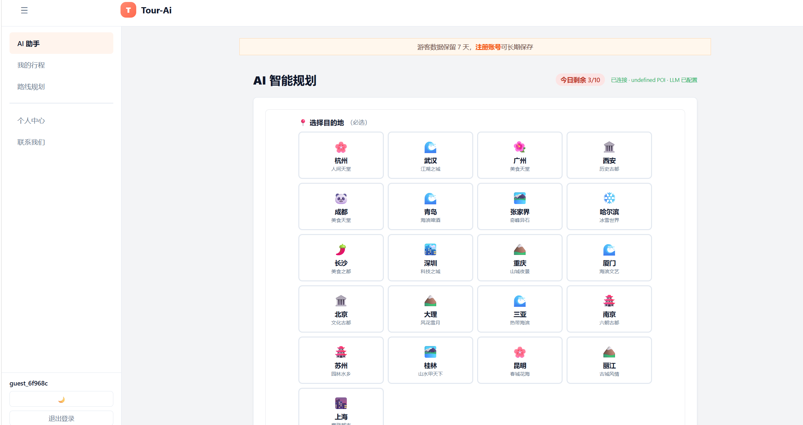
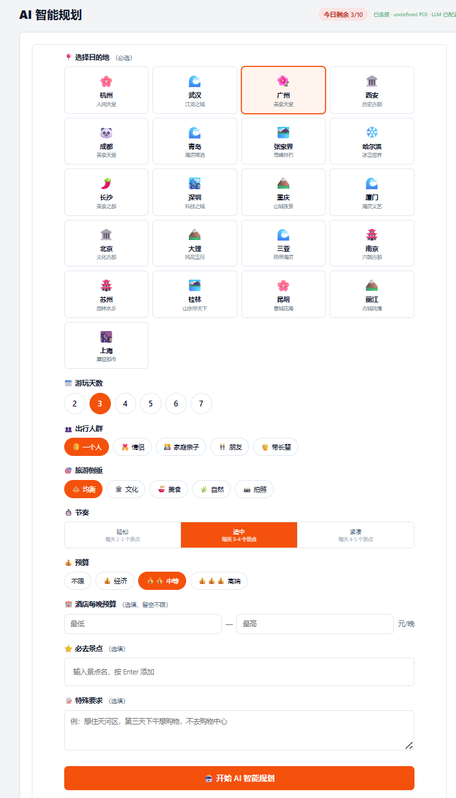

# Tour Pass

> **在线体验**：<https://tour-pass.onrender.com>

Tour Pass 是一个面向城市自由行的 AI 行程规划平台。你可以选择目的地、游玩天数、同行人群、旅行偏好和预算，也可以补充“必去景点”或自然语言要求，系统会结合城市 POI、开放时间和通勤距离生成多日路线，再交给行程编辑器继续调整。

项目采用 **C++17 规划引擎 + Python AI Agent + React 行程编辑器** 的组合架构，当前已通过 Docker 部署到 Render。游客可以直接在线体验，注册后可长期保存自己的行程。

## 真实运行效果

以下图片来自线上部署页面和实际运行录屏，展示了从填写规划条件到查看生成结果的完整链路。

<p align="center">
  
</p>
<p align="center"><em>AI 规划入口：选择城市并进入游客体验。</em></p>

<p align="center">
  
</p>
<p align="center"><em>参数配置：设置天数、人群、偏好、预算和特殊要求。</em></p>

<p align="center">
  
</p>
<p align="center"><em>生成结果：按天组织景点、时间、通勤信息和推荐理由。</em></p>

## 你可以用它做什么

- **快速生成行程**：从城市、天数和旅行偏好出发，生成可执行的多日计划。
- **按个人需求定制**：支持人群、节奏、预算、酒店价格、必去景点和特殊要求等条件。
- **理解每个安排**：行程包含时间段、景点介绍、推荐理由和站点之间的通勤信息。
- **继续编辑和导出**：在 React 编辑器中拖拽调整顺序、跨天移动景点、修改时间，并导出行程。
- **覆盖多个城市**：内置 21 个城市的数据，可切换不同目的地进行规划。

## 使用流程

1. 打开[线上演示](https://tour-pass.onrender.com)，点击“游客体验”即可开始，无需注册。
2. 选择目的地和游玩天数，再设置出行人群、旅游侧重、节奏和预算。
3. 按需填写酒店预算、必去景点和特殊要求，例如“第三天下午想购物，不去购物中心”。
4. 点击“开始 AI 智能规划”，等待系统生成多日行程。
5. 在“我的行程”或“路线规划”中继续编辑路线、查看地图和导出结果。

## 核心能力

| 模块 | 对用户的价值 | 主要实现 |
| --- | --- | --- |
| AI 行程规划 | 将结构化条件或自然语言需求转成多日路线 | LangGraph、LLM、RAG、POI/酒店检索 |
| 路线优化 | 在景点偏好、开放时间和通勤成本之间取得平衡 | Beam Search、Dijkstra/A*、时间窗校验 |
| 智能推荐 | 为景点生成更具体的游玩建议，减少模板化描述 | 多维评分、地理聚类、推荐语生成 |
| 行程编辑器 | 生成后仍可手动调整，不必重新规划 | React、TypeScript、Zustand、dnd-kit |
| 地图与导出 | 直观看路线并保存可分享的行程 | Leaflet、路线绘制、JSON/PDF 导出 |

### 规划引擎细节

- **Beam Search 行程生成**：在上午、午餐、下午、晚餐和晚上等时间槽中保留 Top-K 状态，综合评分、通勤和时间窗约束规划路线。
- **多策略候选**：支持少走路、紧凑、文化优先、美食优先和雨天室内等策略，并通过 Pareto 非支配排序量化取舍。
- **可插拔通勤数据**：支持本地 `edges.json` 和高德路线 API 两类通勤时间来源。
- **文本检索与解释**：使用 BM25 进行 POI 搜索，并提供匹配词解释。
- **异步规划任务**：通过 `POST /trip/jobs` 提交任务，轮询获取结果，支持队列和历史查询。

### AI Agent 规划链路

```text
用户需求
  → 意图抽取
  → 城市攻略与 POI 检索
  → 景点 / 酒店筛选
  → 每日路线规划
  → Beam Search 优化
  → 行程解释与推荐语生成
```

### React 行程编辑器

- 选择城市、天数、酒店和行程段的 Wizard 引导流程
- 景点拖拽排序，支持跨天移动和时间调整
- 高德地图路线渲染、起终点标记和 POI 高亮
- Command 模式撤销 / 重做
- LocalStorage 自动保存，支持行程 JSON 导入 / 导出
- PDF 导出、PWA 缓存和移动端响应式布局

## 数据规模

- **21 个城市数据集**：共 9,588 个城市 POI（景点 / 餐饮 / 酒店 / 交通）；根目录另保留 703 条样例 POI
- **通勤边**：21 城共 49,429 条，当前数据均标记为高德路线；根目录样例数据另有 2,022 条边，来源比例不同
- **城市攻略**：每城配 guidebook.json，包含交通、美食、住宿、注意事项等结构化信息
- **推荐语**：支持本地模板和 LLM 两种生成方式；未配置或禁用 LLM 时自动回退到本地模板
- 预置城市：长沙、武汉、北京、上海、广州、深圳、成都、重庆、杭州、南京、西安、青岛、厦门、苏州、昆明、大理、丽江、桂林、三亚、哈尔滨、张家界

以上数据以 `npm run validate:data:all` 的当前校验结果为准；仓库当前校验覆盖 21 个城市数据集和 1 个根目录样例数据集。

## 环境要求

**本地开发（Windows）**：
- MinGW `g++` + `mingw32-make`，或 CMake 3.16+
- Node.js 18+（脚本和前端）
- Python 3.10+（Agent 服务）
- 可选：OpenSSL（仅在需要通过 CMake 直接请求 HTTPS LLM 接口时使用）

**Docker / 线上部署**：
- Docker（本地验证）
- Render / 任意支持 Docker 的 PaaS（线上部署）

## 常用命令

**C++ 后端**（Makefile 构建）：

```powershell
mingw32-make build       # 编译
mingw32-make test        # 运行测试
mingw32-make run         # 编译并启动服务
mingw32-make clean       # 清理构建产物
mingw32-make validate-data  # 数据质量校验
```

CMake 构建（默认跳过测试目标，适合 Docker 和生产环境）：

```powershell
cmake -S . -B build
cmake --build build
```

启用 CMake 测试目标：

```powershell
cmake -S . -B build -DTOURPASS_BUILD_TESTS=ON
cmake --build build
ctest --test-dir build
```

**Python Agent 服务**：

```powershell
pip install -r requirements-multi-agent.txt
python -m uvicorn api_multi_agent:app --host 0.0.0.0 --port 8090
```

上面启动的是当前 Docker 和 Render 默认使用的多 Agent 服务。`agent/requirements.txt` 与
`python -m agent.main` 仍保留用于 legacy Agent 兼容运行。

**React 编辑器**（开发模式）：

```powershell
cd web/editor
npm install
npm run dev               # Vite 开发服务器
```

服务默认监听：

```text
http://127.0.0.1:8080      # C++ 后端
http://127.0.0.1:8090      # Agent 服务
http://127.0.0.1:5173      # 编辑器开发服务器
```

## 环境变量

### C++ 后端

| 变量 | 说明 | 默认值 |
|------|------|--------|
| `PORT` | 监听端口 | `8080` |
| `HOST` | 监听地址 | `127.0.0.1` |
| `TOURPASS_DEFAULT_CITY` | 默认规划城市 | 城市列表中的第一个可用城市（当前为 `changsha`） |
| `TOURPASS_DB_PATH` | SQLite 数据库路径 | `storage/tourpass.sqlite` |
| `DATABASE_URL` | PostgreSQL 连接串；配置后优先使用 PostgreSQL | - |
| `TOURPASS_DB_DISABLED` | 禁用数据库，使用纯内存演示模式 | `0` |
| `LLM_DISABLED` | 禁用 LLM（演示模式） | `0` |
| `OPENAI_API_KEY` | LLM API Key | - |
| `LLM_BASE_URL` | LLM API 地址 | `https://api.deepseek.com` |
| `LLM_MODEL` | LLM 模型名 | `deepseek-chat` |
| `TOURPASS_JWT_SECRET` | JWT 签名密钥 | - |
| `TOURPASS_API_KEY` | API 访问密钥 | - |
| `TOURPASS_AMAP_API_KEY` | 高德地图 API Key | - |
| `TOURPASS_WORKERS` | 工作线程数 | 按 CPU 核数计算，最多 `8` |
| `TOURPASS_MAX_QUEUE` | HTTP 请求队列上限 | `64` |
| `TOURPASS_JOB_WORKERS` | 异步规划任务 worker 数 | `1` |
| `TOURPASS_MAX_BODY_BYTES` | JSON 请求体大小上限 | `65536` |
| `TOURPASS_BEAM_WIDTH` | Beam Search 宽度 | `5` |
| `TOURPASS_DISTANCE_CACHE_MODE` | 距离缓存模式 | `auto` |
| `RESEND_API_KEY` | 邮件服务 API Key | - |
| `RESEND_FROM_EMAIL` | 发件人邮箱 | - |

### Agent 服务

| 变量 | 说明 | 默认值 |
|------|------|--------|
| `AGENT_PORT` | Agent 服务端口 | `8090` |
| `AGENT_IMPL` | Agent 实现 | `multi`（Docker/Render 默认） |
| `AGENT_BASE_URL` | Agent 服务地址 | `http://127.0.0.1:8090` |
| `DEEPSEEK_API_KEY` | DeepSeek API Key | - |
| `CPP_BACKEND_URL` | C++ 后端地址 | `http://127.0.0.1:8080` |
| `QWEATHER_KEY` | 和风天气 API Key | - |
| `QWEATHER_API_HOST` | 和风天气 API Host | `devapi.qweather.com` |

### 前端

| 变量 | 说明 | 默认值 |
|------|------|--------|
| `VITE_HOTEL_API_KEY` | 前端酒店服务 API Key | - |

LLM 配置：默认读取 `config/llm.local.json`，格式参考 `config/llm.example.json`。本地配置存在密钥时不会被单独残留的 `OPENAI_API_KEY` 覆盖。

## Docker 部署

```powershell
docker build -t tour-pass:local .
docker run --rm -p 8080:8080 `
  -e LLM_DISABLED=1 `
  -e TOURPASS_JWT_SECRET=local-dev-secret-change-me `
  tour-pass:local
node scripts/container_smoke.js http://127.0.0.1:8080
```

Docker 镜像默认 `LLM_DISABLED=1` 作为演示安全默认值；启动时仍必须提供 `TOURPASS_JWT_SECRET`。
多阶段构建包含 C++ 后端和 Python Agent 服务。部署细节见 [docs/deployment.md](docs/deployment.md)。

## API 接口

### C++ 后端 API

```powershell
# 健康检查
curl.exe http://127.0.0.1:8080/health

# 自然语言行程规划（LLM）
curl.exe -X POST http://127.0.0.1:8080/trip/chat \
  -H "Content-Type: application/json; charset=utf-8" \
  --data-binary "@docs/sample_chat_request.json"

# 结构化行程规划
curl.exe -X POST http://127.0.0.1:8080/trip/plan \
  -H "Content-Type: application/json; charset=utf-8" \
  --data-binary "@docs/sample_trip_request.json"

# 异步行程规划
curl.exe -X POST http://127.0.0.1:8080/trip/jobs \
  -H "Content-Type: application/json" \
  -d "{\"city\":\"beijing\",\"days\":3}"

# 查询异步任务状态
curl.exe http://127.0.0.1:8080/trip/jobs/{job_id}

# 候选路线查询
curl.exe -X POST http://127.0.0.1:8080/trip/alternatives \
  -H "Content-Type: application/json" \
  -d "{\"city\":\"beijing\",\"days\":2}"

# 行程解释
curl.exe -X POST http://127.0.0.1:8080/itinerary/explain \
  -H "Content-Type: application/json" \
  -d "{\"city\":\"beijing\",\"days\":1}"

# POI 搜索
curl.exe "http://127.0.0.1:8080/poi/search?q=故宫&limit=3"

# 最短路径查询
curl.exe "http://127.0.0.1:8080/route/shortest?from=amap_d0197c46&to=amap_f3d362be"

# 城市列表
curl.exe http://127.0.0.1:8080/cities

# 服务指标
curl.exe http://127.0.0.1:8080/metrics

# 用户注册
curl.exe -X POST http://127.0.0.1:8080/auth/register \
  -H "Content-Type: application/json" \
  -d "{\"email\":\"user@example.com\",\"password\":\"pass123\"}"

# 用户登录
curl.exe -X POST http://127.0.0.1:8080/auth/login \
  -H "Content-Type: application/json" \
  -d "{\"email\":\"user@example.com\",\"password\":\"pass123\"}"
```

### Agent 代理 API

C++ 后端自动代理 `/agent/*` 请求到 Agent 服务：

```powershell
# Agent 健康检查
curl.exe http://127.0.0.1:8080/agent/health

# Agent 行程规划（同步）
curl.exe -X POST http://127.0.0.1:8080/agent/plan-sync \
  -H "Content-Type: application/json" \
  -d "{\"city\":\"beijing\",\"days\":3,\"preferences\":\"文化历史\"}"

# Agent 对话式规划
curl.exe -X POST http://127.0.0.1:8080/agent/chat \
  -H "Content-Type: application/json" \
  -d "{\"message\":\"我想去北京玩3天，喜欢历史文化\"}"
```

完整 API 文档见 [docs/openapi.yaml](docs/openapi.yaml)。

## CI 与质量保障

仓库提供 GitHub Actions 工作流 `.github/workflows/ci.yml`，在 PR 和 main push 时执行：
- Ubuntu/Windows CMake 构建与 CTest
- Windows 上启动服务运行核心 API 冒烟测试

本地验证：

```powershell
# 数据质量校验
mingw32-make validate-data

# API 冒烟测试
powershell -ExecutionPolicy Bypass -File scripts/api_smoke.ps1 -AppPath bin/tourpass.exe -Port 8091

# 性能基准测试
node scripts/benchmark.js --app bin/tourpass.exe --port 8092 --duration 60 --warmup 5 --concurrency-steps 1,10,50,100,200

# 算法质量检查
node scripts/algorithm_quality_check.js

# 数据验证
node scripts/validate_data.js
```

## 项目结构

```text
├── src/                    # C++ 后端源码（API、规划、搜索、图算法、LLM、存储）
├── include/tourpass/       # 头文件（数据模型、接口定义）
├── agent/                  # Python AI Agent 服务
│   ├── main.py             # Agent 服务入口（FastAPI + LangGraph）
│   ├── graph.py            # 主规划 pipeline（意图抽取→RAG→搜索→规划→优化）
│   ├── scorer.py           # 多维评分引擎（10+ 维度）
│   ├── clustering.py       # 地理聚类（DBSCAN）
│   ├── rag.py              # RAG 检索（TF-IDF）
│   ├── prompts.py          # LLM 提示词模板
│   └── tools.py            # POI/酒店搜索工具（含本地 JSON fallback）
├── third_party/            # 第三方库（httplib, json, sqlite3）
├── web/                    # 前端页面
│   ├── editor/             # React 行程编辑器（Vite + TypeScript + Tailwind）
│   │   ├── src/components/ # UI 组件（Wizard、地图、时间线、协作、分析）
│   │   ├── src/core/       # 核心逻辑（Command 模式、验证规则、服务）
│   │   └── src/stores/     # 状态管理（Zustand）
│   ├── app.js              # 主应用脚本（Leaflet 地图 + 行程渲染）
│   └── admin.js            # 管理页面
├── data/                   # 城市 POI、通勤边、攻略数据（21 城市）
├── config/                 # 配置文件（amap 城市配置、LLM 配置模板）
├── scripts/                # 数据采集、清洗、验证、推荐语优化脚本
├── tests/                  # C++ 单元测试 + Node 集成测试
├── docs/                   # OpenAPI 文档、部署说明
├── CMakeLists.txt          # CMake 构建配置
├── Makefile                # MinGW 构建配置
├── Dockerfile              # 多阶段 Docker 构建（含 Agent 服务）
└── render.yaml             # Render 部署配置（含 PostgreSQL）
```

## 技术架构


## 安全说明

- 密钥通过环境变量或 `config/llm.local.json`（已 gitignore）注入，代码中不硬编码
- `.gitignore` 已排除 `.claude/`、`.trae/`、`config/llm.local.json`、`.env`、`output/`、`storage/` 等敏感目录
- API Key 校验使用常量时间比较
- 密码哈希在启用 OpenSSL 时使用 PBKDF2-HMAC-SHA256（100,000 轮）；无 OpenSSL 时使用 10,000 轮迭代哈希 fallback。生产部署必须启用 OpenSSL
- SQL 查询全部参数化
- JWT 鉴权支持角色权限控制（admin/user/guest）
- 用户查询配额控制（guest 3 次/天，user 10 次/天，admin 无限制）

## License

ISC
