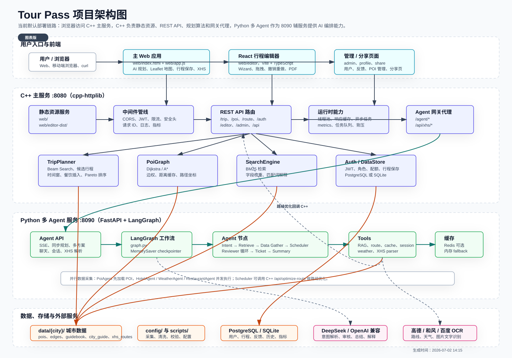
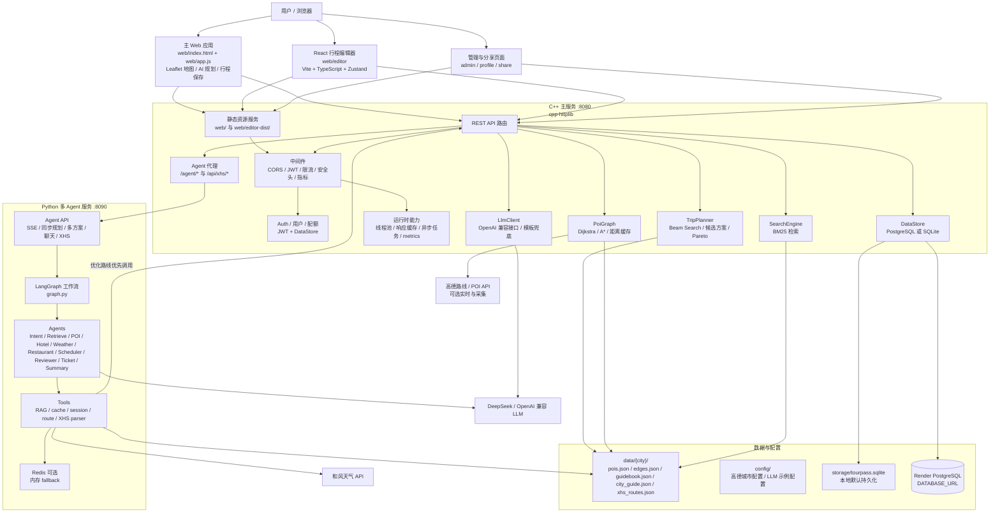
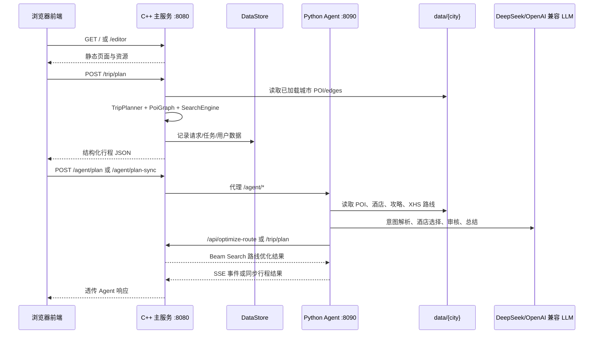
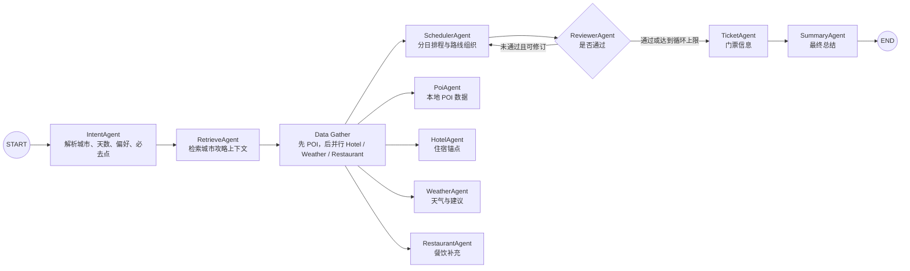
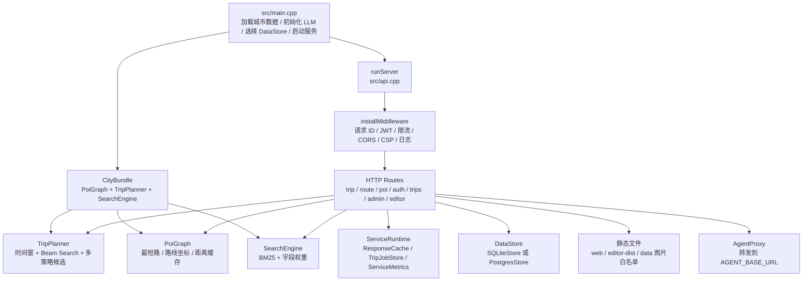
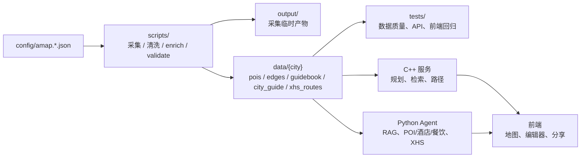
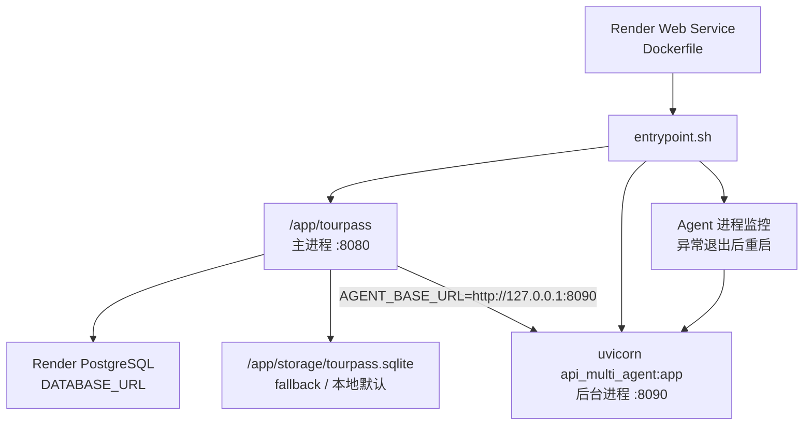

# Tour Pass 架构图

本文档基于当前代码入口生成：

- C++ 主服务入口：[src/main.cpp](../src/main.cpp)
- HTTP 路由与网关：[src/api.cpp](../src/api.cpp)
- 默认 Agent 服务入口：[api_multi_agent.py](../api_multi_agent.py)
- 多 Agent 图构建：[graph.py](../graph.py)
- React 编辑器 API 封装：[web/editor/src/utils/api.ts](../web/editor/src/utils/api.ts)
- 容器启动脚本：[entrypoint.sh](../entrypoint.sh)

## 系统总览

上方 SVG 是可直接查看的图表版；下方 Mermaid 保留为可编辑源码，方便后续维护。

## 核心请求链路

## Python 多 Agent 工作流

默认容器启动 `api_multi_agent:app`，其内部复用 `graph.py` 编译后的 LangGraph。

## C++ 主服务内部模块

## 数据生产与消费

## 部署形态

## 关键边界

- C++ 主服务是线上入口，负责静态资源、认证、持久化、核心规划、检索、路径与 Agent 代理。
- Python Agent 是增强规划层，负责自然语言理解、多 Agent 编排、多轮会话、RAG、天气、XHS 解析和行程总结。
- Python 路线优化优先回调 C++ `/api/optimize-route`，失败后才退回 Python 近邻 + 2-opt。
- 城市 POI、通勤边和攻略数据主要来自 `data/{city}`，采集和清洗脚本位于 `scripts/`。
- 持久化通过 `DataStore` 抽象切换 PostgreSQL 或 SQLite；Agent 缓存/会话通过 Redis 可选，缺省退回内存。
