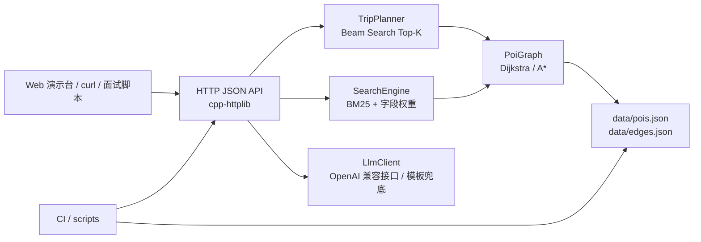

# Tour Pass 架构说明

## 模块图

## 请求链路

1. 服务启动时加载 `data/pois.json` 和 `data/edges.json`，校验 POI、通勤边和图可达性。
2. `PoiGraph` 建立 POI id/name 索引和邻接表，提供 Dijkstra 与 A* 路径查询。
3. `/trip/plan` 将偏好解析为 `TripRequest`，`TripPlanner` 在上午、午餐、下午、晚餐、晚上等时间槽执行 Beam Search，保留 Top-K 局部状态。
4. 候选行程根据策略权重生成轻松、紧凑、文化、美食、雨天等方案，再用标准非支配分层输出 Pareto rank。
5. `/poi/search` 使用 BM25 饱和项、字段权重和匹配词解释返回 POI 检索结果。
6. `/itinerary/explain` 优先通过内置 HTTP client 调用 OpenAI 兼容接口；未配置、失败或 `LLM_DISABLED=1` 时返回本地中文模板。
7. GitHub Actions 运行数据验证、CMake 构建、CTest 和 Windows API 冒烟测试。

## 面试演示路径

1. 运行 `mingw32-make test` 展示核心行为测试。
2. 运行 `powershell -ExecutionPolicy Bypass -File scripts/demo.ps1` 启动服务并打开本地 Web 演示台。
3. 在演示台生成 5 个候选方案，讲路线带、每日时间轴、Beam Search、策略权重、评分拆解和 Pareto 分层。
4. 查询 `hotel_wuyi -> yuelu_academy`，讲 Dijkstra/A* 路径模块。
5. 搜索 `室内 艺术`，讲 BM25 字段权重和匹配词解释。
6. 运行 `node scripts/benchmark.js --app bin/tourpass.exe --port 8092 --iterations 20 --warmup 3 --report docs/performance_report.md`，讲 avg/p95 性能基线。
7. 切换 `LLM_DISABLED=1`，说明离线模板兜底和稳定演示边界。

## 关键取舍

- 不接真实地图 API：通勤时间来自本地样例边，保证面试现场可离线复现。
- 不追求最优旅行商全局解：Beam Search 在可解释性、速度和候选多样性之间取平衡。
- 不强依赖远程 LLM：LLM 只是解释层增强，核心规划结果由结构化算法产生。
