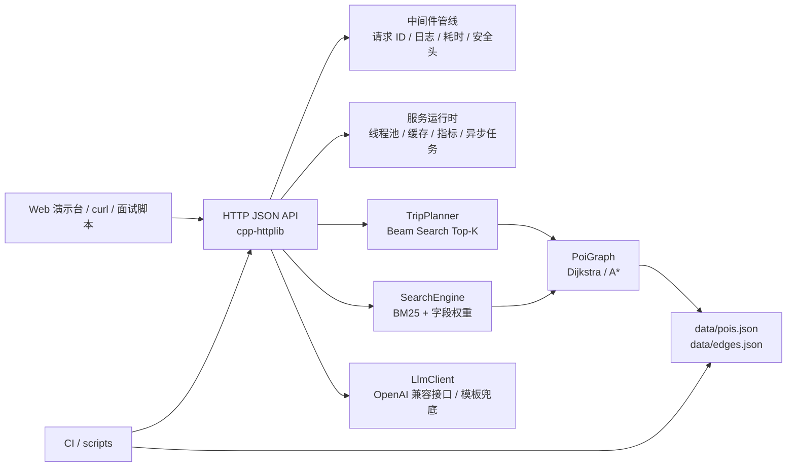

# Tour Pass 架构说明

## 模块图

## 服务端运行时

服务启动时会显式配置 `cpp-httplib` 线程池，`TOURPASS_WORKERS` 控制 worker 数，`TOURPASS_MAX_QUEUE` 控制请求队列上限，`TOURPASS_MAX_IN_FLIGHT` 控制进行中请求背压。`PoiGraph`、`TripPlanner`、`SearchEngine` 和 `LlmClient` 在请求处理中按只读依赖使用；可变状态集中在进程内响应缓存、指标聚合器、异步任务仓库和 SQLite 持久化封装中，并用互斥锁或原子计数保护。

HTTP 中间件通过 `set_pre_routing_handler`、`set_post_routing_handler`、`set_exception_handler` 和 `set_logger` 实现。请求处理前写入 `X-Request-Id`、CORS 和安全响应头，处理后记录 `X-Response-Time-Ms`、状态码和接口耗时。异常统一返回 `{ "error": { "code", "message", "details" } }`，请求体超过限制时返回 `PAYLOAD_TOO_LARGE`。

`/route/shortest`、`/poi/search` 和 `/trip/plan` 使用进程内 LRU + TTL 热点缓存，响应头通过 `X-Cache` 展示命中状态。`POST /trip/jobs` 提供异步规划链路，后台 worker pool 执行规划，队列满时返回 `QUEUE_FULL`。SQLite 默认保存规划请求、异步任务、benchmark 记录和数据版本；规划热路径仍读取内存图，不在每次算法计算中查库。

边界说明：`cpp-httplib` 是轻量单头文件库，本项目用它承载本地演示 HTTP API、静态页面和中间件 hook，不把它包装成生产级 C++ Web 服务框架。当前长沙样例数据为 `25 POI / 46 edges`，适合说明架构闭环和算法可解释性，不用来证明高并发或大规模图搜索性能。

## 请求链路

1. 服务启动时加载 `data/pois.json` 和 `data/edges.json`，校验 POI、通勤边和图可达性。
2. `PoiGraph` 建立 POI id/name 索引和邻接表，提供 Dijkstra 与 A* 路径查询。
3. `/trip/plan` 将偏好解析为 `TripRequest`，`TripPlanner` 在上午、午餐、下午、晚餐、晚上等时间槽执行 Beam Search，保留 Top-K 局部状态。
4. 候选行程根据策略权重生成轻松、紧凑、文化、美食、雨天等方案，再用标准非支配分层输出 Pareto rank。
5. `/poi/search` 使用 BM25 饱和项、字段权重和匹配词解释返回 POI 检索结果。
6. `/itinerary/explain` 优先通过内置 HTTP client 调用 OpenAI 兼容接口；未配置、失败或 `LLM_DISABLED=1` 时返回本地中文模板。
7. GitHub Actions 运行数据验证、CMake 构建、CTest 和 Windows API 冒烟测试。
8. `scripts/benchmark.js` 可用 `--concurrency-steps 1,10,50,100,200 --record-db` 压测同步规划、缓存命中、背压和异步任务端到端耗时，并把 `/metrics` 快照写入性能报告和 SQLite。

## 面试演示路径

1. 运行 `mingw32-make test` 展示核心行为测试。
2. 运行 `powershell -ExecutionPolicy Bypass -File scripts/demo.ps1` 启动服务并打开本地 Web 演示台。
3. 在演示台生成 5 个候选方案，讲路线带、每日时间轴、Beam Search、策略权重、评分拆解和 Pareto 分层。
4. 查询 `hotel_wuyi -> yuelu_academy`，讲 Dijkstra/A* 路径模块。
5. 搜索 `室内 艺术`，讲 BM25 字段权重和匹配词解释。
6. 运行 `node scripts/benchmark.js --app bin/tourpass.exe --port 8092 --iterations 20 --warmup 3 --concurrency 8 --report docs/performance_report.md`，讲 avg/p95、线程池、缓存命中和异步任务性能基线。
7. 切换 `LLM_DISABLED=1`，说明离线模板兜底和稳定演示边界。

## 关键取舍

- 不接真实地图 API：通勤时间来自本地样例边，保证面试现场可离线复现。
- 不追求最优旅行商全局解：Beam Search 在可解释性、速度和候选多样性之间取平衡。
- 不强依赖远程 LLM：LLM 只是解释层增强，核心规划结果由结构化算法产生。
- 不引入数据库/Redis：当前面向本地演示，缓存、任务和指标使用进程内实现；真实生产环境可替换为持久化任务表、分布式缓存和标准监控系统。
- SQLite 只用于持久化历史、任务、benchmark 和数据版本；它不支撑规划热路径，也不作为“数据库支撑高并发”的卖点。
