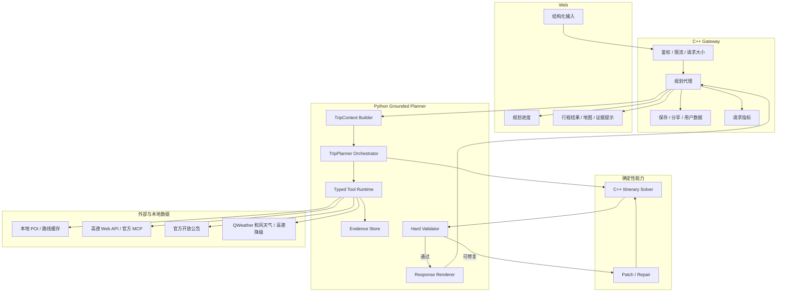

# 01：目标架构与核心契约

> 本文定义“系统必须如何工作”。具体开发顺序见 [02-implementation-plan.md](02-implementation-plan.md)。

## 1. 设计目标与非目标

### 1.1 设计目标

- 在一次用户提交中生成事实可核验、路线可执行、硬约束满足的行程。
- 让 LLM 负责擅长的开放式路线构想、体验排序和自然语言解释。
- 让工具负责地点、开放状态、路线、天气等外部事实。
- 让确定性算法负责时间窗、顺序、闭环、硬约束和修复。
- 每个关键结论都能追踪到用户约束、工具证据或求解器决策。
- 保留现有 C++ 网关、鉴权、存储和部署能力，避免为了转型重写整套工程。

### 1.2 非目标

- 不建设通用聊天机器人。
- 不追求让模型自主决定所有工具调用。
- 不建设完整事件溯源或插件平台。
- 不做行程拖拽编辑器。
- 不做跨行程长期记忆。
- 不在首版承诺票务库存、价格或预约执行。

## 2. 运行时分层



## 3. 主规划器状态机

一次 `PlanningRun` 按固定阶段推进，模型不能跳过强制验证阶段。

| 阶段 | 输入 | 输出 | 是否可调用 LLM |
|---|---|---|---|
| `CONTEXT_READY` | 用户请求 | 标准化 `TripContext` | 否 |
| `SKELETON_PROPOSED` | `TripContext` + 少量城市摘要 | `PlanSkeleton` | 是，第 1 次 |
| `EVIDENCE_RESOLVED` | 路线骨架中的地点/区域/时段 | `EvidenceBundle` | 否，工具调用 |
| `PLAN_SOLVED` | 上下文 + 已解析证据 | `ItineraryPlan` | 否 |
| `PLAN_VALIDATED` | 结构化计划 | `ValidationReport` | 否 |
| `PLAN_REPAIRED` | 失败项 + 可用替代项 | `PlanPatch` | 默认否 |
| `RESPONSE_RENDERED` | 已通过计划 | 最终响应 | 是，第 2 次，可关闭 |
| `FAILED` | 无法满足的硬约束 | 可解释失败 | 否 |

LLM 调用采用请求级共享预算：默认总预算为 2，绝对上限为 3。骨架 schema 纠错、证据驱动的受约束重规划和结果解释都消耗同一预算；结果解释优先级最低，预算已用于纠错或重规划时改用确定性模板。任何额外规划调用仍只能输出新的 `PlanSkeleton` 或 `PlanSkeletonPatch`，并必须重新经过实体、开放状态、路线、求解和硬校验。

停止条件：

- 校验通过；
- 达到 3 次确定性修复上限；
- 必去地点无法解析或指定日期确认关闭；
- 关键路线工具不可用且没有已验证缓存；
- 总耗时或外部 API 预算耗尽。

## 4. 上下文设计

### 4.1 原则

模型上下文不是数据库，也不是所有运行状态的拼接结果。每次 LLM 调用只接收完成当前任务必要的信息。

结构化输入用于减少歧义，不要求用户预先确定所有旅行细节。外部请求只强制 `city`；日期、天数、节奏、预算、同行人、酒店、必去项、交通方式和附加要求均可留空。`TripContext Builder` 必须将空字符串、`null`、缺失字段和常见枚举别名归一化，采用的默认值写入 `assumptions` 并随结果返回，不能静默伪装成用户选择。

`special_requests` 保留用户原文，同时提取可确定执行的约束：少走路、每日站点上限、午餐预留、住宿区域和明确避免项进入 `ConstraintProfile` 并由 Solver/Validator 执行；无法可靠结构化的部分保留在 `freeform_requirements` 供骨架 LLM 参考。LLM 不得覆盖提取出的确定性约束。

第一轮路线骨架上下文只包含：

- 城市、日期、天数、每日起止时间；
- 酒店或住宿区域；
- 必去、兴趣、节奏、预算等级、同行人；
- 明确避免项；
- 城市级简短区域提示；
- 输出 schema 和禁止编造规则。

第二轮结果解释上下文只包含：

- 已固定的最终计划；
- 已核验事实和来源摘要；
- 风险与未知项；
- 禁止修改结构化事实的约束。

不得把以下内容整包塞入模型：

- 全城 POI JSON；
- 完整路线矩阵；
- 所有攻略/RAG chunk；
- 原始第三方 API 响应；
- 旧多 Agent 的全部中间消息；
- 与本次任务无关的用户历史。

### 4.2 本阶段记忆边界

| 类型 | 是否实现 | 说明 |
|---|---|---|
| 单次请求工作状态 | 是 | 仅在 `PlanningRun` 生命周期内存在 |
| 工具证据缓存 | 是 | 按实体、日期、来源和 TTL 缓存 |
| 规划 trace | 是 | 用于调试、评估和线上观测 |
| 已保存行程 | 保留 | 沿用现有存储能力 |
| 用户长期偏好 | 否 | 等有明确多次使用数据后再做 |
| 多轮聊天记忆 | 否 | 主链路不再依赖聊天修复 |

## 5. 核心数据契约

建议使用 Pydantic 定义 Python 边界模型，并生成 JSON Schema。跨 Python/C++ 的公共字段必须有契约测试。

### 5.1 `TripContext`

```json
{
  "request_id": "uuid",
  "city": "长沙",
  "date_start": "2026-09-12",
  "days": 3,
  "timezone": "Asia/Shanghai",
  "daily_window": {"start": "09:00", "end": "21:30"},
  "hotel": {"name": null, "area": "五一广场", "required_anchor": true},
  "travelers": {"count": 2, "profile": "adult"},
  "pace": "relaxed",
  "interests": ["history", "food", "night_view"],
  "must_visit": ["橘子洲", "岳麓山"],
  "avoid": ["long_queue", "excessive_walking"],
  "budget_level": "medium",
  "transport_preferences": ["taxi", "metro", "walking"],
  "special_requests": "每天中午预留正常用餐时间",
  "constraints": {"reserve_lunch_minutes": 75, "prefer_low_walking": false, "max_stops_per_day": null},
  "assumptions": []
}
```

规范化要求：

- 外部请求只要求城市；空日期默认从次日起算、空天数默认 3 天、空节奏默认标准、空侧重默认均衡、空交通默认驾车/打车，并将这些选择写入 `assumptions`。
- `must_visit` 保留用户原词，同时建立规范化实体映射；空字符串、`null` 和缺失值都归一化为空列表。
- `pace`、兴趣和避免项必须映射到枚举或稳定列表，不能把自然语言直接交给求解器。
- 酒店未指定具体实体时，优先使用用户给出的住宿区域；两者均未提供时选择本地酒店锚点或候选区域虚拟锚点，并明确置信度。
- `special_requests` 原文不得丢失；可解析要求写入 `ConstraintProfile`，未解析部分保留并在结果中提示实际采用的假设。

### 5.2 `PlanSkeleton`

`PlanSkeleton` 是 LLM 的提案，不是最终行程。

```json
{
  "days": [
    {
      "day": 1,
      "theme": "橘子洲与老城夜景",
      "area_sequence": ["五一广场", "橘子洲", "太平街", "杜甫江阁"],
      "place_queries": [
        {"query": "橘子洲景区", "role": "must_visit", "preferred_period": "morning"},
        {"query": "杜甫江阁", "role": "night_view", "preferred_period": "evening"}
      ],
      "experience_notes": ["避免午后暴晒", "夜景安排在日落后"]
    }
  ]
}
```

限制：

- 只表达区域顺序、候选地点和体验意图。
- 不允许输出未经工具确认的精确通勤、营业时间、票价或分店地址。
- 每个必去项必须出现在某个 `place_query`，否则骨架直接判无效并重新生成一次或失败。
- 本地数据库不需要预先包含模型提到的全部地点；每个查询先匹配本地规范名、别名和 `source_id`，未命中、歧义、过期、必去项或分店查询再在线调用高德关键词/详情搜索。
- 除模型明确给出的地点外，工具还要根据每天的区域、主题和体验角色扩展候选，避免“模型未点名、本地就永远不召回”的封闭候选池。
- 道路、校园、社区、海滨浴场、文创园等高德非传统景区类型先映射为 Tour Pass 的 `urban_walk`、`campus`、`neighborhood`、`beach` 等旅行角色，不得仅因不属于高德 `110000` 风景名胜而丢弃。

### 5.3 `PlaceEvidence`

```json
{
  "entity_id": "amap:...",
  "query": "玉楼东五一路店",
  "canonical_name": "",
  "aliases": [],
  "status": "unresolved",
  "category": "restaurant",
  "location": null,
  "branch_confirmed": false,
  "open_status": "unknown",
  "open_windows": [],
  "reservation": {"required": null, "url": null},
  "sources": [
    {
      "provider": "amap",
      "retrieved_at": "2026-08-29T10:00:00+08:00",
      "source_ref": "provider-record-id",
      "freshness": "live",
      "confidence": 0.42
    }
  ],
  "warnings": ["未找到可确认的当前门店，不得进入最终行程"]
}
```

地点状态枚举：`resolved`（唯一实体）、`ambiguous`（多候选）、`unresolved`（无可信实体）、`closed`（不可用）、`unknown`（数据不足）。

### 5.4 `RouteEvidence`

```json
{
  "from_entity_id": "amap:a",
  "to_entity_id": "amap:b",
  "mode": "driving",
  "depart_at": "2026-09-12T14:30:00+08:00",
  "duration_minutes": 28,
  "distance_meters": 11500,
  "provider": "amap",
  "retrieved_at": "2026-08-29T10:03:00+08:00",
  "confidence": "verified",
  "cache_status": "miss"
}
```

规则：直线距离只能用于候选粗筛，不能显示为通勤时间，也不能通过最终可达性校验；缓存路线必须保留 provider、采集时间、交通方式和验证状态；去程和返程分别建边；酒店/住宿区域到首站、末站回酒店都必须有路线证据。当前缓存中 `amap_status=partial` 的边不能仅凭 `source=amap` 视为全方式已核验；由出租车时间乘系数得到的公交时间、由距离推导的步行时间和任意 `geo_estimated` 值必须保持 `estimated`，不得通过对应交通方式的硬校验。

### 5.5 `ItineraryPlan`

最终计划必须完全引用已解析实体和路线证据。

```json
{
  "plan_id": "uuid",
  "version": 1,
  "city": "长沙",
  "hotel_anchor": {"entity_id": "amap:hotel", "name": "示例酒店"},
  "days": [
    {
      "day": 1,
      "date": "2026-09-12",
      "theme": "橘子洲与老城夜景",
      "start_anchor": "amap:hotel",
      "end_anchor": "amap:hotel",
      "stops": [],
      "route_segments": [],
      "totals": {"visit_minutes": 360, "commute_minutes": 95, "walking_minutes": 45}
    }
  ],
  "evidence_snapshot_id": "uuid",
  "validation_report_id": "uuid"
}
```

每个 stop 至少包含：`entity_id`、规范名、类别、坐标；到达/离开时间、停留时长；当日角色；开放状态和来源引用；安排原因；事实不完整时的 warning。

### 5.6 `ValidationReport`

```json
{
  "passed": false,
  "hard_failures": [
    {
      "code": "MUST_VISIT_MISSING",
      "message": "必去项“岳麓山”未进入行程",
      "repairable": true
    }
  ],
  "soft_scores": {"interest_match": 0.82, "area_coherence": 0.76, "commute_efficiency": 0.71},
  "warnings": []
}
```

## 6. 工具注册与执行协议

首版工具数量控制在 6～8 个，所有工具必须是 typed input / typed output。

| 工具 | 责任 | 主要实现 | 是否强制 |
|---|---|---|---|
| `search_places` | 查找并扩展候选实体，不负责最终确认 | 本地缓存 → 高德 Web API/官方 MCP | 是 |
| `resolve_place` | 规范名、别名、唯一实体、分店、类别和坐标消歧 | 确定性规则 + 高德关键词/详情 | 是 |
| `check_place_status` | 指定日期开放、预约、临时关闭 | 官方证据优先，地图状态和缓存后备 | 重要景点强制 |
| `get_route_matrix` | 按实际交通方式获取真实通勤矩阵 | 已验证本地缓存 → 高德在线补边 | 是 |
| `get_weather` | 指定日期天气、生活指数和预警 | QWeather（和风天气）主源 → 高德基础天气降级 | 有明确日期时强制 |
| `solve_itinerary` | 时间窗、顺序、闭环、节奏 | C++ 求解器 | 是 |
| `validate_itinerary` | 硬门禁和软指标 | Python/C++ 确定性校验 | 是 |
| `render_explanation` | 解释固定结果 | LLM 或模板 | 可选 |

统一工具返回：

```json
{
  "ok": true,
  "value": {},
  "model_summary": "供模型读取的短摘要",
  "provenance": [],
  "warnings": [],
  "retryable": false,
  "latency_ms": 123
}
```

约束：原始供应商响应不直接进入 prompt；凭据永远不进入模型上下文、trace 和错误响应；工具超时、限流、空结果必须显式返回；相同输入使用 request-level 去重。

### 6.1 Provider 边界

Grounded Planner 只依赖上述 Tour Pass typed tools，不直接依赖供应商工具名。`AmapProvider` 可以由高德 Web API 或官方 MCP Streamable HTTP 实现，两者输出必须先归一化为同一 `PlaceEvidence` / `RouteEvidence`；原始高德响应、MCP 工具描述和带 key 的 URL 不进入模型上下文或普通 trace。核心 POI、详情和批量路线首版优先复用仓库现有 Web API 客户端，官方 MCP 用于受控能力验证、专属地图/导航或作为可替换 provider，不为采用 MCP 改变规划器合同。

官方能力依据：[高德 MCP 概述](https://lbs.amap.com/api/mcp-server/summary)、[高德 MCP 快速接入](https://lbs.amap.com/api/mcp-server/gettingstarted)、[高德天气 Web API](https://lbs.amap.com/api/webservice/guide/api/weatherinfo)。文档中的第三方 provider 能力只以官方文档和实际录制响应为准。

本地 `data/{city}/pois.json` 与 `edges.json` 定位为低延迟召回、已核验缓存和离线 benchmark，不是完整数据库或唯一事实来源。2026-08-30 审计发现 21 城市共 9,588 个 POI，但 5,152 个景点全部使用默认 `09:00-21:30`；49,429 条路线边中 49,397 条为 `amap_status=partial`，只有 32 条为 `ok`，有向 POI 对覆盖率约 1.109%。现有结构校验通过只证明字段和图结构有效，不代表开放时间、热门地点召回和各交通方式已经核验。

实体解析顺序固定为：本地规范名/别名/`source_id` 命中 → 高德关键词搜索 → 高德详情确认 → 城市、类别、区域和分店的确定性消歧。不得盲取供应商 Top 1；普通候选无法唯一确认时淘汰，必去项无法唯一确认时返回 `needs_clarification` 或明确失败。在线结果先写入本次 Evidence Store，满足来源、TTL 和缓存策略后才进入共享缓存。

QWeather 是和风天气的英文产品和 API 名称，不是新的天气供应商。首版继续复用 `tools/weather_api.py`，以和风天气提供三日/七日预报、日出日落、UV、降水、生活指数和灾害预警；高德天气仅在和风天气不可用时提供基础预报降级。当前不接入来源和维护责任未确认的第三方天气 MCP。

## 7. 证据优先级与时效

### 7.1 来源优先级

开放/闭馆信息：官方公告 > 政府/文旅官方渠道 > 地图供应商当前 POI 状态 > 人工审核数据 > 普通攻略/社区内容。社区内容只能作建议，不能单独作硬事实。

路线信息：指定方式的在线结果 > 带 provider、采集时间和方式的预计算路线 > 缺失时返回不可验证；不使用直线距离伪造。

### 7.2 建议 TTL

| 数据 | TTL | 备注 |
|---|---:|---|
| POI 实体与坐标 | 30 天 | 查询时仍检查停业状态 |
| 分店状态 | 7 天 | 餐厅和商业门店变化更频繁 |
| 常规开放时间 | 7 天 | 节假日需更短或实时复核 |
| 临时闭馆公告 | 24 小时 | 指定旅行日期前应复核 |
| 驾车/步行路线 | 30 天 | 非实时拥堵估计 |
| 公交路线 | 7 天 | 线路更改风险高 |
| 天气预报 | 3 小时 | 只在服务可覆盖日期使用 |

## 8. 求解器职责

首版继续复用 C++ `TripPlanner`、`PoiGraph`、`/api/optimize-route` 和现有时间窗能力，但输入必须升级为带证据、时间窗和酒店锚点的候选集。

### 8.1 硬约束

- 必去项 100% 覆盖；若确实不可用，整单失败并解释原因，不能静默遗漏。
- 所有地点为唯一可定位实体；任意相邻站点有真实路线证据。
- 指定日期和到达时段可开放；未知状态按策略阻止或警告。
- 到达、停留、通勤和缓冲时间不重叠，不超过每日结束时间。
- 每日从酒店/住宿锚点出发并回到该锚点，除非用户明确指定异地结束。
- 夜景、夜市等时段语义正确，餐饮处于合理窗口。
- 普通商店、住宅、中介、二手市场等不能进入景点槽。
- 轻松节奏满足日总步行、总通勤、连续游玩和站点数上限。

### 8.2 软目标

硬约束全通过后才比较：兴趣匹配、经典覆盖、区域连贯、总通勤、折返、重复过江、步行强度、餐饮质量、天气匹配、主题完整性和多日多样性。不得再用单一加权总分让软目标抵消硬失败。

## 9. 校验与修复

### 9.1 Validator 顺序

1. Schema 完整性；2. 实体唯一性与类别；3. 必去覆盖；4. 开放与日期；5. 路线证据；6. 时间轴；7. 酒店闭环；8. 节奏与步行；9. 时段与餐饮；10. 软质量指标。

### 9.2 确定性修复

允许删除非必去低优先级站点、移动日期/时段、交换相邻站点、替换同区域同类别候选、缩短弹性停留、取消不顺路餐厅、将远距离必去项独立成轻量一天、按天气替换已核验候选。

禁止编造新地点、把未解析字符串加入计划、修改用户硬约束、删除路线段或缩短通勤来“修复”、让 LLM 整体重写最终结构绕过校验。

## 10. API 迁移与观测

建议新增外部 `POST /api/itineraries/plan`，内部 Python `POST /planner/plan`。SSE 事件固定为 `accepted`、`stage`、`warning`、`result`、`error`。兼容期将 `/agent/plan-structured` 映射到新 planner，其余旧规划接口 deprecated；`/trip/chat` 只作为 legacy 基线和回滚。

每次请求生成 `request_id`，记录阶段、模型/提示版本、工具输入哈希、来源、缓存、耗时、实体状态、路线 verified 比例、校验失败码和成本。不得记录 key、Cookie、Authorization、原始推理或大段第三方响应。

## 11. RAG 的新定位

通用“攻略检索后塞入 prompt”退出主链路。保留的垂直证据必须有来源、更新时间、实体/日期映射和失效策略。适合保留官方公告、景区内部路线、小众规则、人工审核区域组合和未来用户明确确认的偏好；社区内容只能影响候选发现或软偏好。
