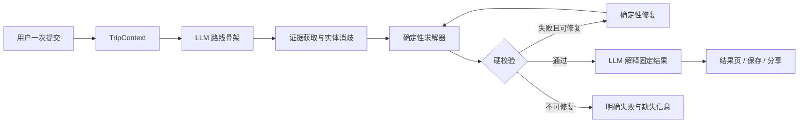

# Tour Pass 可信行程规划器转型方案

> 文档状态：实施中（Phase 0～4 首条纵向链路已落地，生产灰度未开始）  
> 制定日期：2026-08-29  
> 开始实施：2026-08-31  
> 目标版本：Grounded Planner MVP  
> 回退标签：`grounded-planner-before-migration-20260830`

## 1. 先看结论

Tour Pass 不再继续扩充“景点 Agent、酒店 Agent、餐厅 Agent、Reviewer Agent”等角色式多 Agent，也暂不继续投入复杂行程编辑器。

项目转型为：

> 一个主规划器负责完整任务；LLM 提出路线骨架和体验取舍；地图、开放状态、天气等工具提供真实证据；确定性求解器安排时间与顺序；硬校验器决定结果能否交付。

目标不是“一次模型调用”，而是“一次用户提交”。一次提交内部允许有限、可追踪的工具调用和确定性修复，但不能把错误留给用户通过多轮对话纠正。

## 2. 本轮产品边界

### 保留并重点建设

- 结构化旅行需求输入；只强制城市，其余字段允许留空并采用透明默认值。
- 一次生成质量高、可执行的多日行程。
- 必去项、日期、节奏、酒店区域和每日时段等约束；附加要求同时进入 LLM 骨架与确定性约束。
- 真实 POI 实体消歧、分店确认和地点存在性检查。
- 真实通勤时间、路线方式和每日酒店闭环。
- 开放/闭馆/预约提示及证据来源。
- 天气对室内外安排的影响。
- 简洁结果页、地图、通勤段、风险提示。
- 保存、分享、整单重新规划。
- 规划 trace、质量评估、灰度和回滚能力。

### 暂停投入

- React 行程编辑器及拖拽式编辑。
- 生成后的自然语言多轮修改。
- 多人协作、版本树和复杂编辑历史。
- 通用长期记忆。
- 角色式多 Agent 编排。
- 无来源、无时效的通用旅游 RAG。
- 通用 Agent 插件平台、任意代码执行和跨 Agent 协议。

### 暂不物理删除

编辑器和旧多 Agent 首先隐藏入口、停止进入主链路，并保留一段灰度回滚期。新链路稳定、线上无依赖后再删除源码、构建产物、接口和测试。

## 3. 为什么这样转型

当前问题并不是模型能力不够，而是职责分配不合理：

- LLM 只做需求解析、候选评价和文案，无法主导高层路线骨架。
- 本地候选池质量会把错误 POI 强行喂给后续步骤。
- 必去项等硬要求仍可能被总分中的“少走路”抵消。
- 真实路线和开放信息介入过晚。
- Reviewer 混合主观评价与硬约束，且可以在信息不足时放行。
- 多个 Agent 共享大状态并反复转述，没有形成真正的工具权限、状态所有权或独立决策价值。

已做的同条件长沙对照实验显示：直接 LLM 的宏观分区与叙事明显优于项目结果，但仍会出现门店幻觉、闭馆信息错误、通勤不足和折返。由此得到的正确分工是：

- 不用本地规则压制 LLM 的常识规划能力；
- 也不信任 LLM 独立完成实体、时效、路线和约束计算；
- 用工具和确定性算法把 LLM 的路线构想变成可验证结果。

## 4. Pi 与 DSH 思路的取舍

本次只借用适合当前垂类产品的部分，不复制通用 Agent 平台。

| 来源 | 借用 | 本阶段不借用 |
|---|---|---|
| Pi 风格 | 小而清晰的主循环、显式上下文构建、typed tools、工具前后钩子、有限步数、完整 trace | 无界自治循环、为了“更 Agent”而让模型决定所有步骤 |
| DSH 风格 | 工具结果带结构化值与来源、运行事件可审计、原始事实与模型上下文分离、失败和降级显式化 | 完整事件溯源平台、动态插件生命周期、复杂 projection registry |
| Tour Pass 领域能力 | C++ 路线/时间窗算法、城市数据、鉴权、存储、Render 单容器部署 | 继续维护多条互相竞争的生产规划链路 |

因为本阶段产品仍是一次性行程生成，所以不建设长期 `TripSession` 和通用记忆系统。只保留单次 `PlanningRun` 的事件 trace、证据快照和结果版本。未来只有在用户确实需要行前监控、行中重规划或跨天任务时，才升级为持久 Trip Mission。

## 5. 目标链路



核心原则：

1. LLM 可以提出地点和区域，但未经实体解析的名称不能进入最终行程。
2. 真实路线是求解输入，不是生成后展示用的装饰。
3. 必去覆盖、开放时间、可达性、每日闭环等是布尔门禁，不进入可互相抵消的加权总分。
4. 修复最多 3 轮，优先使用确定性 patch，不重新让 LLM 自由改写整份行程。
5. 最后一次 LLM 只解释已经固定的结构化结果，不得新增地点、时间、票价或事实。

## 6. 唯一生产链路

转型完成后只允许一条生产规划路径：

```text
Web 结构化表单
  → C++ 网关（鉴权、限流、保存、代理）
  → Python Grounded Planner（主规划器和工具编排）
  → C++ Solver / 外部数据工具
  → Hard Validator
  → 统一 ItineraryResponse
```

迁移期保留旧接口作为兼容别名和回滚路径，但前端、测试和监控必须指向新实现。旧 C++ `/trip/chat`、多个 Python `/agent/plan*` 和多轮修改接口不得继续各自演进。

### 6.1 数据与外部工具决策

2026-08-30 的只读审计确认：21 个城市目录共有 9,588 个 POI 和 49,429 条路线边，现有结构校验全部通过，但这不能证明旅游语义完整。5,152 个景点的开放时间全部是默认 `09:00-21:30`；49,397 条路线边标记为 `amap_status=partial`，只有 32 条为 `ok`；现有路线仅覆盖城市内全部有向 POI 对的约 1.109%。因此本地 POI 和路线数据改定位为低延迟召回、已核验缓存和离线 benchmark，不再作为唯一事实来源。

高德已提供官方 MCP Server，具备关键词/周边/详情搜索、驾车/步行/公交/骑行路径、距离和基础天气能力。Grounded Planner 仍只暴露自己的 typed tools；高德 MCP 或高德 Web API 只能作为 provider adapter，不能把供应商原始工具和响应直接交给 LLM。首版核心实体与路线查询优先复用现有高德 Web API 客户端及批量能力，官方 MCP 可用于受控验证、专属地图和导航能力，或作为可替换 provider。

天气主 provider 继续使用项目已经接入的和风天气（英文产品/API 名称为 QWeather），复用 `tools/weather_api.py` 的预报、日出日落、UV、降水、生活指数和灾害预警能力；高德天气只作基础降级。当前不引入来源和维护责任未确认的第三方天气 MCP。

实体解析采用“本地命中优先、在线补查、确定性消歧”：本地无结果、存在歧义、证据过期、涉及必去项或分店时必须查询高德关键词和详情；普通候选无法唯一确认则淘汰，必去项无法唯一确认则返回澄清或明确失败。最终相邻路线和酒店首尾闭环必须按实际交通方式在线补边或命中未过期的已验证缓存，推导公交时间、直线距离和默认时间不得标记为已核验。

## 7. 文档阅读顺序

1. [01-architecture-and-contracts.md](01-architecture-and-contracts.md)：确认架构、上下文、工具、数据契约和校验原则。
2. [02-implementation-plan.md](02-implementation-plan.md)：按阶段查看具体文件、任务、依赖和退出条件。
3. [03-evaluation-and-release.md](03-evaluation-and-release.md)：确认如何证明质量提升，以及如何上线、灰度和回滚。

## 8. 需要你重点评审的 8 个决策

请优先判断以下内容是否同意；其余实现细节可在开发中小幅调整。

- [x] 同意“一个主规划器”，停止新增角色式 Agent。
- [x] 同意每次 `PlanningRun` 使用有界、分阶段、可配置的 LLM 调用预算；默认最多 2 次、绝对上限 3 次，骨架纠错/证据驱动重规划与结果解释共享预算，禁止无界模型—工具循环。
- [x] 同意必去覆盖、实体存在、开放、可达、时间不冲突、每日闭环为硬门禁。
- [x] 同意通用 RAG 退出关键路径，只保留有来源和时效的垂直证据。
- [x] 同意先隐藏编辑器，稳定后再物理删除。
- [x] 同意首版继续使用 C++ 网关 + Python planner + Render 单容器，不做后端重写。
- [x] 同意用长沙、青岛、重庆作为固定质量基准，未达到门槛不得切换生产默认实现。
- [x] 同意先恢复知识图谱工具并重新索引，再开始结构性代码修改。

## 9. 完成定义

Grounded Planner MVP 只有同时满足以下条件才算完成：

- 三个基准城市的硬约束通过率达到文档规定门槛。
- 必去项不再被软评分抵消。
- 最终地点全部能映射到唯一实体或明确标记为无法确认。
- 所有展示的通勤时间来自真实路线数据；估算值不得冒充已核验数据。
- 每日首尾锚点、时间窗、节奏和闭环通过硬校验。
- 旧版与新版有可复现对照报告，而不是主观挑选示例。
- 新链路具备超时、缓存、降级、trace、监控和回滚。
- 编辑器和多轮修改不在默认用户路径中。
- 相关测试、容器 smoke、`git diff --check` 和知识图谱刷新均完成。

## 10. 当前实施状态

2026-08-31 已对 `D:/Tour Pass` 当前工作区完成 `moderate`、`persistence=true` 的知识图谱索引；远端回退标签 `grounded-planner-before-migration-20260830` 指向改造前提交 `f91bb5861b7d66cc072020fe1ae48fc169e72c3b`。

首条纵向链路已经可运行：现有结构化表单 → C++ `/api/itineraries/plan` 代理 → Python `GroundedPlanner` → 高德实体/路线、和风天气主源/高德降级 → 带动态候选与 verified 路线矩阵的 C++ `/api/optimize-route` → 独立 Hard Validator → 现有结果页。旧 `/agent/plan-structured` 由 `TOURPASS_GROUNDED_PLANNER_ENABLED=false` 保留回滚路径。

当前仍未满足整个 MVP 完成定义：三城市 30/90 条 benchmark、官方开放公告适配、生产 trace 持久化、影子运行、成本/延迟门槛和 7～14 天灰度观察尚未完成，因此不得把本地纵向 smoke 视为生产发布完成。
