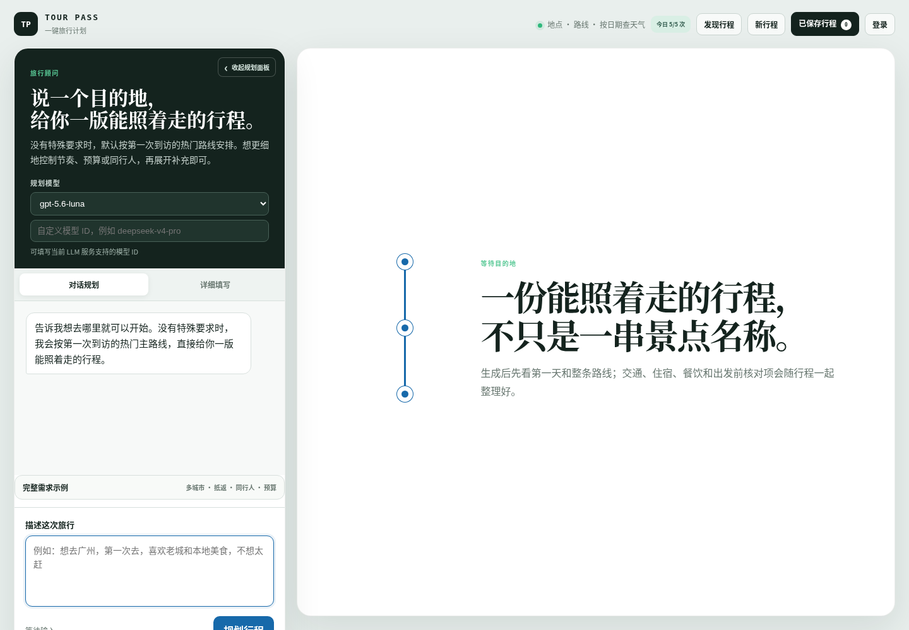
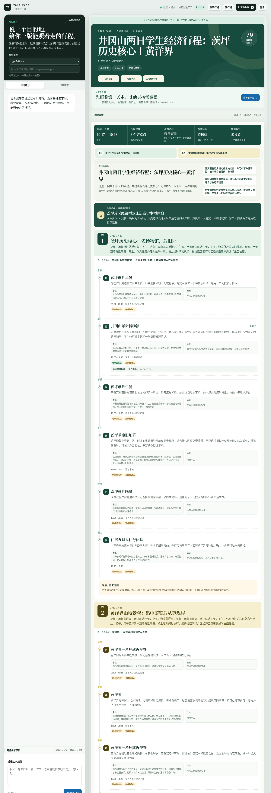
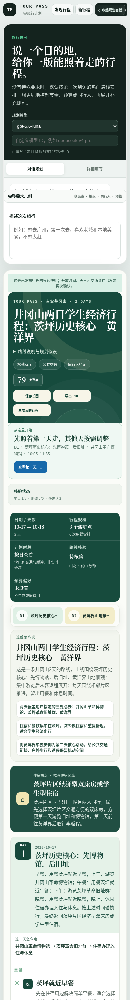
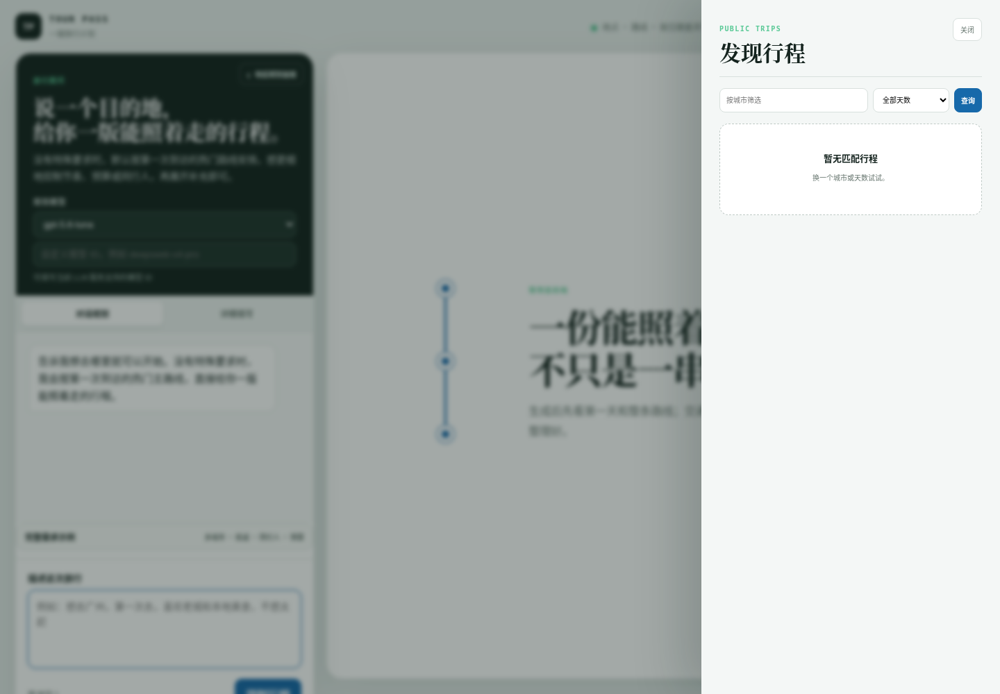

# Tour Pass 竞品调研、发展方向、路线图与漏洞排查报告

- 项目：Tour Pass（https://github.com/4evour/Tour-Pass ，线上：https://tour-pass.onrender.com/ ）
- 报告日期：2026-09-27（所有时间均为 UTC+8）
- 撰写方式：GitHub 连接器通读仓库代码（未 clone、未修改仓库）；以访客身份在线上部署真实跑了一次规划并测试分享接口；网页检索、App Store 公开接口、GitHub API 收集竞品；headless Chrome 对公开页面静态截图。
- 截图目录：`screenshots/`
- 原始数据：`/workspace/tour-pass-report/live/`（线上运行 SSE 原文与解析结果）、`gh_repos.json`（158 个 GitHub 仓库元数据）、`appstore.json` / `appstore_discovery.json`（App Store 评分数据）

---

## 0. 摘要（先看这一节）

**一句话结论**：Tour Pass 的工程底子（确定性组装、硬校验、证据链、重放评测、鉴权/CSRF/额度、生产部署）明显强于 GitHub 上大量同质的"LangGraph + 高德 MCP + 多 Agent"学生项目；但它作为"通用 AI 行程规划器"正面对的是携程、飞猪、高德、马蜂窝等拥有库存和 POI 数据的巨头，以及圆周旅迹这类已有近千万（自述）用户的独立产品，**不应再在"通用规划"上正面竞争**。建议把它收敛为：

> **"可执行性体检 + 行程手册"引擎，首发场景锁定井冈山红色研学 / 大学生经济游。**
> 用户可以用 Tour Pass 直接生成，也可以把豆包、DeepSeek、Codex、小红书攻略里拿到的行程粘贴进来，Tour Pass 负责：实体绑定 → 交通/开放/预约/预算逐项体检 → 标出"已核验 / 未知 / 有风险" → 输出一本好看、可打印、可分享、不泄露隐私的行程手册。

这与 README 已经写下的转向（"专用规划 Agent 不如 Codex 等通用工具，后续重点是把 LLM 行程合理、美观地展示出来"）完全一致，也与海外 Voyaiger「Vet My Itinerary」、国内高德「避雷指南（15 维校验）」验证了同一个用户需求：**AI 能写行程，但没人替你核对行程能不能走通**。

**最严重的 5 个漏洞**（详见第 3 节）：
1. **访客额度可绕过 → AI 费用可被刷**：`auth.client_ip()` 信任 `X-Forwarded-For` 最左值（可伪造），配合"无 cookie 即新访客"，可无限获得每天 5 次额度；注册限流同样依赖可伪造 IP 且存在进程内存。
2. **客户端可指定任意模型**：`ChatRequest.model` 任意填写并原样转发给 LLM 网关，`/api/llm/models` 明示 `custom_allowed: true`，首页有"自定义模型 ID"输入框。
3. **公开分享泄露用户原始输入（线上实测确认）**：`plan_json` 内嵌 `planning_context`，发布时整份快照公开，匿名接口返回 `freeform_requests`（用户原话）、notes、party 等。
4. **未经同意把行程放进发现页**：访客登录/注册时 `claim_guest_trips` 把其分享强制改为 `public`；登录用户发布永远是 public，与 README"私密分享"不符。
5. **`session_id` 长度约束不一致（80 vs 32）**，PostgreSQL 下超长 ID 触发 502；以及每个无 cookie 请求都写一行 `WebSession` 且无清理任务，可被刷库。

**竞品覆盖**：国内 37 个（10 个 OTA/地图平台、18 个独立 App、3 个井冈山本地数字化产品、6 个通用大模型）、海外 26 个、开源 45 个（含 3 个基准/数据集与 1 个 awesome 列表，均带 GitHub 实时 star 数），合计 108 个条目。

**最值得参考的 3 个**：
1. **高德地图「避雷指南」**——从营业时间、拥挤度、停车等 15 个维度校验行程，是 Tour Pass HardValidator 最直接的对标和"校验维度清单"来源。
2. **Voyaiger「Vet My Itinerary」**（海外）——免登录粘贴任意行程做体检，证明"只做校验"可以单独成为产品入口；Tour Pass 可以做它的中文 + 真实地图数据版本。
3. **同济大学交通学院「井冈山红色旅游交通指引小程序」**——实地实测观光车 A/B/C 线、茨坪免费公交、停车场与步行连接，恰好补上 Tour Pass 在井冈山实测中"交通证据 0 段、观光车 0 次提及"的空白；同济对口支援井冈山大学，具备合作可能。
（工程参考另推荐 FloatTrip 的 OR-Tools 约束排程、TREK 的协作/离线/PWA/MCP 完整工程、ChinaTravel 基准的 DSL 约束评测。）

---

## 1. 项目现状

### 1.1 仓库元数据（GitHub API，2026-09-27）

| 项 | 值 |
|---|---|
| 可见性 | 公开 |
| Star / Fork / Open issue | 31 / 2 / 0 |
| 创建 / 最近推送 | 2026-05-14 / 2026-09-26 |
| LICENSE | **无**（法律上他人不能合法复用，也影响开源评价） |
| Topics | 无 |
| repo size | 约 270MB（当前文件树很小，推测历史中曾提交大文件，未核实） |
| Secret scanning / Dependabot | 未启用 |
| CI（`.github/workflows`） | **无**（KNOWN_ISSUES K-003 已自认） |

### 1.2 技术栈与结构

- 后端：Python 3.12、FastAPI、SQLAlchemy（本地 SQLite / 生产 PostgreSQL）、httpx、argon2-cffi、psycopg。
- 前端：原生 JS（`trip_agent/static/app.js` 约 1445 行）+ `index.html` + `styles.css`，无构建步骤。
- 部署：Dockerfile（python:3.12-slim，非 root `appuser`）+ `render.yaml`（Render Web 服务 + PostgreSQL）。
- 核心模块：`app.py`（路由）、`auth.py`（会话/CSRF/额度）、`store.py`（持久化、发布）、`models.py`、`db.py`、`contracts.py`（Pydantic 请求模型）、`context.py`（需求解析）、`loop.py`（主流程）、`llm.py`、`workflow.py`（127KB，行程组装与修复）、`validation.py`（HardValidator）、`plan_output.py`、`evaluate.py`（录制与确定性重放）、`cache.py`（ProviderCache）、`observability.py`（日志脱敏）、`runtime.py`（配置默认值）、`providers/amap.py`、`rail.py`、`weather.py`。
- 测试：`tests/trip_agent_test.py`（156KB 单文件，KNOWN_ISSUES 记载 97–109 项通过）。
- 文档：README、CHANGELOG、KNOWN_ISSUES、CODEX_COMPARISON_REPORT、TEST_FOLLOWUP、`research/` 下 4 个调研目录（含生产复盘 thesis）。
- 工具产物：`.codebase-memory/graph.db.zst`（约 685KB）被提交入库。

### 1.3 生成流程（读代码整理）

1. 结构化表单或自然语言输入 → `context.py` 正则 + 规则解析出城市、日期、人数、预算、必去点等。
2. `auth.py` 校验身份、CSRF、所有权、每日额度（访客 5 次、用户 20 次、admin 100000 次）。
3. LLM 一次生成行程骨架 JSON（OpenAI 兼容：chat_completions 或 responses；默认 DeepSeek，线上默认 `gpt-5.6-luna`）；解析失败最多再用 `COMPACT_RETRY_PROMPT` 重试一次。
4. 并行调用高德 POI / 路线、天气、12306 时刻（带 SQLite ProviderCache）。
5. `ItineraryAssembler` 确定性组装时间轴，`plan_repair` 去重、补餐。
6. `HardValidator` 区分硬失败与警告，计算完整度分（checks 列表）。
7. 保存版本，通过 SSE 推送事件给前端。
8. `evaluate.py` 支持录制与确定性重放，用于回归评测。

### 1.4 做得好的地方（答辩和简历应重点讲）

- 密码 Argon2id；cookie `tp_session` httponly；`tp_csrf` 双提交 + 与数据库哈希比对。
- 所有权隔离（`_owned`），分享 slug 用 `secrets.token_hex(10)`（80 bit，不可枚举）。
- CSP `script-src 'self'`、`X-Frame-Options: DENY`、`nosniff` 等安全头；前端输出统一 `escapeHtml`，XSS 风险低。
- 日志脱敏（`observability._redact`），`.env` 已 gitignore，未发现硬编码密钥。
- "诚实"的产品哲学：完整度分、`unknowns` 列表、`needs_verification` 状态、证据引用，而不是像多数 AI 规划器那样把幻觉包装成确定信息——这正是行业评测指出的短板（"强于内容推荐，弱于执行落地"）。
- 确定性重放评测 + 与 Codex 的对比报告（CODEX_COMPARISON_REPORT），在学生项目中罕见。
- 自我复盘文档质量高（KNOWN_ISSUES、生产复盘 thesis），问题意识强。

---

## 2. 真实运行结果（线上部署，访客身份）

### 2.1 测试方法

- 时间：2026-09-27 约 22:17（UTC+8）。
- 方式：`curl` 以访客身份调用线上 `/chat` SSE 接口，完整保存事件流（`live/stream.txt`）与解析结果（`live/result.json`）。
- 请求原文：
  > 规划吉安井冈山2天行程，2026年10月17日到10月18日，学生两人，预算经济，公共交通为主，必去：茨坪革命旧址群、黄洋界、井冈山革命博物馆
- 选择这个请求的原因：它正好是用户所在地、最可能的首发场景，也最能检验"垂直地区 + 学生 + 公共交通"这一方向的现状。

### 2.2 结果总览

| 指标 | 结果 |
|---|---|
| 总耗时 | **68 秒**（模型约 61 秒，首个文本 11.4 秒） |
| 硬校验 | 通过 |
| 完整度 | **79 分（19 项中 15 项通过）** |
| 工具调用 | 1 次区域解析 + 9 次 POI 搜索 + 1 次天气；**路线调用 0 次** |
| 交通证据 | **已核验 0 段，时间轴约需 9 段** |
| 实体绑定 | 3 个必去点只绑定了"井冈山革命博物馆"（B031C018HH）；**茨坪革命旧址群、黄洋界未绑定**（UNRESOLVED_ENTITY） |
| 开放时间 | 全部 unknown |
| 天气 | 日期超出预报窗口，不可用（如实标注） |
| 预算 | 未给金额，`estimated_total: null`，coverage unavailable |
| 预约任务 | 3 条，全部 `needs_verification`，`deadline` 与 `booking_url` 均为 null |
| 住宿 | 只给出"茨坪片区经济型双床房或学生型住宿"，无实体、无坐标 |
| 城际交通 | `intercity: []`，未提吉安西站、井冈山站或大巴 |
| 响应体 | 约 110KB，events 中重复包含 `candidate_plan` 与 `validation_report` |

### 2.3 生成的时间轴

| 日期 | 时间 | 安排 |
|---|---|---|
| 10-17（六）茨坪历史核心 | 09:00–09:45 | 茨坪就近早餐 |
| | 10:05–11:35 | 井冈山革命博物馆（已绑定实体） |
| | 11:35–12:50 | 茨坪就近午餐 |
| | 13:10–16:10 | 茨坪革命旧址群（未绑定） |
| | 17:00–18:15 | 茨坪就近晚餐 |
| | 18:15–19:45 | 住宿办理入住与休息 |
| 10-18（日）黄洋界 | 09:00–09:45 | "黄洋界—茨坪就近早餐" |
| | 10:05–13:05 | 黄洋界（未绑定） |
| | 13:05–14:20 | "黄洋界—茨坪就近午餐" |
| | 14:20–15:50 | 茨坪返程前休息与补给 |
| | 17:00–18:30 | "黄洋界—茨坪就近晚餐" |

### 2.4 质量问题（从真实输出中观察到）

1. **核心地点实体绑定失败**：黄洋界、茨坪革命旧址群都是井冈山最核心的景点，却没有绑定成功。这与仓库自己记录的"实体绑定率 22.86%"（生产复盘）和 K-010"POI 未绑定导致交通证据为 0"一致。**这是整个产品可信度的根**：没有实体就没有坐标，没有坐标就没有路线，没有路线就没有交通证据。
2. **没有景区内交通**：茨坪到黄洋界是十几公里山路，必须坐观光车（据同济实践团队报道，井冈山有观光车 A/B/C 三条主线，A 线覆盖小井→龙潭→百竹园→黄洋界，茨坪城区有免费公交）。输出中"观光车"出现 0 次、"公交"0 次，只写了"应查询当天可用的公共交通、景区接驳"。对学生、公共交通为主的用户，这是最关键的信息。
3. **预约信息空缺**：据公开资料，井冈山革命博物馆、烈士陵园等免费景点需在"智慧井冈山"小程序提前预约。输出只写"出发前核对是否需要预约"，没有给出入口。
4. **逻辑瑕疵**："返程前休息 14:20–15:50"之后又安排了 17:00–18:30 晚餐，但没有任何返程交通；D2 的餐饮名称出现"黄洋界—茨坪就近早餐"这种拼接字符串。
5. **需求解析遗漏**："学生两人""预算经济"都没有被解析（`party_size: null`、`budget.preference: null`），虽然 LLM 在 assumptions 里理解了"两名学生的经济型标准"，但结构化字段为空，意味着后续校验与预算模块拿不到这些约束。
6. **校验口径偏松**：completeness 中"开放时间匹配"一项为 **pass**，理由是"地点均标注开放匹配状态"——即所有地点都标了 `unknown` 也算通过。建议把"标注了 unknown"与"核验通过"区分开，否则 79 分会高估真实可执行性。
7. **优点**：没有编造门票价格、开放时间、列车班次；`unknowns` 明确列出"酒店库存、城际班次、餐厅人均、开放时间/预约规则"未接入；博物馆放在第一天上午、同片区聚合的安排合理。

### 2.5 分享隐私实测

- 以访客身份对上述行程调用发布接口（unlisted），得到 slug。
- 匿名（不带 cookie）`GET /api/public/itineraries/{slug}` 返回内容中包含 `planning_context.freeform_requests`（用户原始需求全文）、`latest_request`、notes、party、validation 报告等。**确认漏洞 3 在生产环境真实存在。**
- 测试结束后已调用 `DELETE /api/sessions/{id}/publish` 撤销分享（返回 204），再次访问公开地址返回 404，线上未留下测试数据。
- 其他线上观察：`/api/public/itineraries` 发现页为空；`/api/llm/models` 返回 `{"default":"gpt-5.6-luna","models":["gpt-5.6-luna"],"custom_allowed":true}`；`/health` 公开返回会话数、行程数、缓存统计与数据库类型（postgresql）。
- **未做**：没有在线上实际伪造 XFF 刷额度、没有调用自定义昂贵模型、没有批量注册——这些只做了代码层面的确认，避免对线上服务和用户的 API 费用造成影响。

截图：
- 首页（可见"自定义模型 ID"输入框、"今日 5/5 次"）：`screenshots/tourpass-home-1440.png`

  
- 公开行程页长图（标题"井冈山两日学生经济行程…"，完整度 79）：`screenshots/tourpass-public-plan-1440.png`

  
- 公开行程页移动端：`screenshots/tourpass-public-plan-mobile-390.png`

  
- 发现页：`screenshots/tourpass-explore-1440.png`

  

---

## 3. 漏洞与风险排查

说明：以下问题均来自代码阅读（GitHub 连接器）并标注文件/函数；标"线上实测"的在生产环境做了无害验证。严重程度按"对真实用户/费用的影响 × 利用难度"判断。

### 3.1 汇总表

| # | 严重程度 | 问题 | 位置 | 验证方式 |
|---|---|---|---|---|
| 1 | **高** | 访客额度与注册限流可绕过，LLM/高德费用可被刷 | `auth.py` `client_ip()` / `resolve()` / `consume_quota()` / `check_auth_rate()`；`render.yaml` `TRIP_AGENT_TRUST_PROXY=true` | 代码 |
| 2 | **高** | 客户端可指定任意模型 ID 并被转发给网关 | `contracts.py` `ChatRequest.model`；`app.py` `/api/llm/models`；`loop.py`、`llm.py` | 代码 + 线上接口返回 `custom_allowed:true` + 首页截图 |
| 3 | **中高** | 公开分享泄露原始需求、备注、同行信息、完整校验报告 | `loop.py`（`candidate["planning_context"]=...`）；`store.publish()`；`/api/public/itineraries/{slug}` | **线上实测确认**（已撤销） |
| 4 | **中** | 未经同意将行程放入公开发现页；无"仅链接可见" | `store.claim_guest_trips()`；`store.publish()`；前端 toast 文案 | 代码 |
| 5 | **中** | `session_id` 长度约束不一致（80 vs 32），PG 下 502 | `contracts.ChatRequest.session_id`；`models.TripSession.session_id String(32)`；`app.get_session` | 代码 |
| 6 | **中** | 会话 / 每日用量 / 限流字典无限增长，可被刷库 | `auth.resolve()`（无 cookie 即插入 `WebSession`）；`DailyUsage`；`_attempts` | 代码 |
| 7 | **中** | 高德调用全局串行（≥0.5s 间隔，全体用户共享） | `providers/amap.py` `_rate_lock` / `min_interval` | 代码 + 线上事件时间戳（9 次搜索约 0.45–0.5s 间隔串行） |
| 8 | **中** | 生产默认值与文档不一致（K-001 仍在） | `runtime.py` 默认值 vs README / `.env.example`；`render.yaml` 未覆盖 | 代码 |
| 9 | 低–中 | 信息泄露：`/health` 暴露业务计数与数据库类型；错误信息含异常类名 | `app.py` `/health`、`/chat` 异常分支 | 线上实测 |
| 10 | 低 | 证据外链未限制协议 | `static/app.js` `renderEvidence()` | 代码 |
| 11 | 低–中 | 校验口径：`unknown` 也算"开放时间匹配 pass"，完整度被高估 | `validation.py` completeness checks | 线上输出 |
| 12 | 低–中 | 额度失败不返还；超时过长（LLM 300s / 整体 420s）；响应体冗余 110KB | `auth.consume_quota`；`runtime.py`；`loop.py` events | 代码 + 线上 |
| 13 | 工程 | 无 CI、无 LICENSE、依赖无锁、测试单文件 156KB、工具产物入库、历史体积大、无 HEALTHCHECK | 仓库根 | 代码 |

### 3.2 逐条说明与修复建议

#### 漏洞 1（高）：访客额度与注册限流可绕过

- **成因**：
  - `render.yaml` 设置了 `TRIP_AGENT_TRUST_PROXY=true`，此时 `auth.client_ip()` 取 `X-Forwarded-For` 的**第一个（最左）值**。XFF 最左值是客户端自己可以写的，Render 的代理只会在右侧追加真实地址。
  - `resolve()` 在请求没有 `tp_session` cookie 时直接签发一个新的访客会话。
  - `consume_quota()` 对访客同时按 guest id 和 IP 哈希计数——但 guest id 靠丢弃 cookie 刷新，IP 靠伪造 XFF 刷新，两道闸都能绕过。
  - `check_auth_rate()`（登录/注册限流）同样用这个 IP，并且计数保存在进程内存 dict：重启清零、多实例不共享；注册没有验证码/邮箱验证，每个新账号每天 20 次。
- **影响**：每次规划最多 2 次 LLM 调用 + 最多 18（代码默认）/100（文档）次 Provider 调用；脚本可以无限制地消耗作者的 LLM 与高德额度。对自费部署的学生项目，这是**真金白银**的风险。
- **修复**：
  1. `client_ip()` 改为取 XFF **从右往左数第 N 个可信跳**（Render 前面只有一层代理时取最右值），或直接用平台提供的真实 IP 头；并写单元测试覆盖伪造场景。
  2. 访客额度改为"IP 前缀（/24、IPv6 /64）+ 全局每小时总量"双层；新增每分钟速率限制。
  3. 注册加简单人机验证（如 Cloudflare Turnstile，免费）或邮箱验证；限流计数迁到数据库/Redis。
  4. 设置**全站每日费用熔断**（例如 LLM 调用总次数到阈值后仅允许登录用户）。
  5. 把失败/超时的额度返还（KNOWN_ISSUES 已提"原子预占返还"）。

#### 漏洞 2（高）：客户端可指定任意模型

- **成因**：`ChatRequest.model` 只做字符集校验；`/api/llm/models` 返回 `custom_allowed: True`；首页提供"自定义模型 ID，例如 deepseek-v4-pro"输入框（见 [`screenshots/tourpass-home-1440.png`](screenshots/tourpass-home-1440.png)）；`loop.py` / `llm.py` 原样作为 `model` 参数转发。
- **影响**：任何访客都可以让服务端调用网关上最贵的模型（如推理型大模型），按 token 计费时单次成本可能是默认模型的数十倍；与漏洞 1 叠加风险放大。
- **修复**：服务端白名单（仅允许 `TRIP_AGENT_MODELS` 中的值，其余返回 400）；`custom_allowed` 默认 false，仅 admin 可用；前端隐藏输入框。

#### 漏洞 3（中高）：公开分享泄露原始输入（线上实测确认）

- **成因**：`loop.py` 把 `planning_context` 写进候选方案，随 `plan_json` 保存；`store.publish()` 直接把整份 plan 作为 `snapshot_json`；公开接口匿名返回快照。
- **泄露内容**：`freeform_requests`（最近 8 条用户原话，可能含姓名、手机号、住址、同行人情况、健康状况）、`latest_request`、notes、party、ticket_facts、hotel、完整 validation 报告。
- **修复**：发布时做**白名单投影**（只保留 title、days 中展示字段、map、公开 evidence、unknowns），剔除 planning_context、events、原始消息、内部校验明细；为发布快照写 schema 测试，防止以后新增字段被无意公开；已发布的历史快照做一次迁移清洗。

#### 漏洞 4（中）：未经同意公开到发现页

- `store.claim_guest_trips()` 在访客登录/注册时把其 Publication 强制设为 `visibility="public"`；`publish()` 对登录用户永远 public；前端 toast 写"登录后可加入发现页"，暗示需要用户操作，实际自动加入。
- **修复**：发布接口增加 `visibility`（`private_link` / `public`），默认仅链接可见；claim 时保留原可见性；加入发现页必须显式勾选并二次确认；发现页内容加举报/下架。

#### 漏洞 5（中）：`session_id` 长度不一致

- `ChatRequest.session_id` `max_length=80`，而 `TripSession.session_id` 是 `String(32)`；`app.get_session` 也只检查 >80。PostgreSQL 严格校验长度，33–80 字符的 ID 会触发 `StringDataRightTruncation`，被包装成 502。SQLite 不校验长度，所以本地测试发现不了。
- **修复**：统一用 `^[0-9a-f]{32}$` 正则校验；测试用 PostgreSQL（CI 里起一个 service container）。

#### 漏洞 6（中）：数据表无限增长

- 每个不带 cookie 的请求（包括 `/api/auth/session`、`/api/sessions` 这种轮询接口、爬虫）都会插入一行 `WebSession`；过期会话只在再次访问时删除；`DailyUsage`、内存 `_attempts` 同样没有清理。
- **修复**：只有在需要写状态（首次规划）时才创建访客会话；加定时清理（Render Cron Job 或应用启动时的后台任务）；给 `WebSession.expires_at` 建索引。

#### 问题 7（中）：高德调用全局串行

- `providers/amap.py` 用全局 `_rate_lock` + `min_interval≥0.5s`，所有用户共享，全站吞吐约 2 次/秒。线上一次规划 9 次 POI 搜索就花了约 4–5 秒纯等待；10 个用户同时规划时尾部用户会排队几十秒。
- **修复**：改为令牌桶（按高德实际 QPS 配额，如个人开发者 Key 的并发上限）；同一次规划内对 POI 搜索做批量/并发；ProviderCache 预热井冈山等热门目的地。

#### 问题 8（中）：配置默认值不一致

- `runtime.py`：`MAX_PROVIDER_CALLS=18`，记忆参数 6/4000/30/40/40；README 与 `.env.example`：100/4/800/7/24/24。`render.yaml` 没有显式设置，因此生产按代码默认运行，与文档描述不符。
- **修复**：以 `runtime.py` 为唯一来源，README 表格由脚本生成；在 `render.yaml` 显式写出关键值；加一个测试断言 `.env.example` 与默认值一致。

#### 问题 9–13（低/工程）

- `/health` 只返回 `{"status":"ok"}`，详细统计移到需 admin 鉴权的 `/admin/metrics`；错误响应不要带 `type(exc).__name__`，改为 run_id 供排查。
- `renderEvidence` 外链只允许 `https:`（`new URL(u).protocol === 'https:'`），并加 `rel="noopener noreferrer"`。
- 校验：区分 `verified` / `labeled_unknown` / `failed` 三态，完整度只给 verified 计满分；在 UI 上把"未知"显示为黄色而不是绿色。
- 超时：LLM 300s → 90–120s，并在前端展示"仍在查询 X/Y"进度；响应体去掉 events 中重复的 `candidate_plan`。
- 工程：加 GitHub Actions（ruff + pytest，SQLite 与 PostgreSQL 两种矩阵）；选 LICENSE（希望被复用选 MIT/Apache-2.0，想防闭源商用选 AGPL-3.0）；`pip-tools`/`uv` 生成锁文件；测试按模块拆分；`.codebase-memory/` 加入 `.gitignore`；用 `git filter-repo` 清理历史大文件前先确认内容（这是破坏性操作，需作者自行决定）；Dockerfile 加 `HEALTHCHECK`；开启 Dependabot 与 secret scanning（公开仓库免费）。

### 3.3 未发现问题的方面

- 未发现 SQL 注入（全部走 SQLAlchemy ORM / 参数化）。
- 未发现存储型 XSS（`escapeHtml` 统一输出 + CSP）。
- 未发现越权读取他人会话（`_owned` 检查覆盖了会话、版本、发布接口）。
- 分享 slug 不可枚举。
- 未发现硬编码密钥（只检查了当前文件树，**没有检查 git 历史**；鉴于仓库历史体积异常，建议作者用 `gitleaks` 扫一遍历史）。

---

## 4. 行业背景

- **需求已被教育**：《2026 中国旅游 AI 营销白皮书》（环球旅讯 × Islander）称 86% 受访用户用 AI 做过旅行计划；获取攻略的渠道中社交媒体 65.4%、对话式 AI 59.51%、搜索引擎 43.39%；**67.5% 的用户会去 OTA 二次验证**，形成"种草 → AI 定方案 → OTA 下单"链路。
- **用户画像**：马蜂窝《2026 人工智能 + 旅游趋势报告》称 80、90 后占 AI 旅行用户 73%。
- **执行落地是公认短板**：北京第二外国语学院《AI 旅行助手评价体系》（中国经济网 2025-11-26 报道）结论是行业"强于内容推荐，弱于执行落地"；通用大模型与 OTA 助手相差近 100 分（满分 900）。排名：飞猪问一问 724.92 分第一，其后程心 AI、支付宝出行助手、小红书点点、携程问道、腾讯元宝、豆包、DeepSeek。
- **广告反感**：圆周旅迹博客引用的调研称 53.6% 用户反感 AI 推荐中夹带广告——这对"不卖货、只做核验"的中立工具是机会。
- **2025–2026 的三个趋势**：
  1. **地图平台做"可执行性"**：高德 2026（9 月 16 日发布）上线 15 维避雷校验，百度地图小度想想 2.0 做一键多景点路径。
  2. **"抄作业"成为杀手级入口**：圆周旅迹、问旅、VoyaGO、路敢敢、轻舟旅记、海外 Rhyme / Nowy / doro，全都主打"粘贴小红书/抖音/TikTok 链接 → 提取地点 → 生成行程"。
  3. **Agent 平台化**：ChatGPT Apps 接入 Expedia、Booking；Google AI Mode Canvas；百度地图 Map Agent Plan（MCP）；GitHub 上大量 Claude/Codex 旅行 Skill。规划能力正在变成通用 Agent 的一个插件，独立"规划器"的护城河在变薄——反过来，**"可被 Agent 调用的校验与展示组件"**有需求。

---

## 5. 竞品逐个分析

> 信息获取方式标注：【文章】= 新闻/评测文章；【官网】= 官方网页抓取；【商店】= App Store 公开接口（iTunes Search API，2026-09-27 实时，评分为该区评分）；【截图】= headless Chrome 截取公开页面；【自述】= 厂商自己宣称、未经第三方核实。没有任何竞品做了登录后的交互式体验（原因见第 9 节）。

### 5.1 国内：OTA 与地图平台（10 个）

#### ① 携程 AI 行程助手 / 携程问道
- 定位：OTA 内置 AI 规划 + 预订闭环。2025-09 网页与 App 双端上线。
- 功能：对话生成行程；可视化地图拖拽编辑；一键导出 Excel；导入已有订单；多端同步；携程商旅另有 7 个 Agent，已接入豆包。
- 商业模式：交易佣金。
- 优点：库存、价格、订单全打通；导出 Excel 满足"J 人"习惯。缺点：推荐偏向可售库存；北二外评测中排名第 5。
- 对 Tour Pass 的启示：**"导入已有订单"**和"导出 Excel"是低成本高价值功能。
- 商店：携程旅行 4.66 分 / 176.9 万评分。来源【文章】中国民航网、品橙旅游；【商店】。

#### ② 飞猪「问一问」
- 定位：OTA 多智能体规划。2025-04-17 上线。
- 功能：行程助手、交通顾问、酒店顾问、预算管理师等多 Agent；约 20 秒出方案；机酒价格与房态实时；**预算滑动条**；语音/方言输入；手绘地图、长图分享；行中按位置推荐周边；最初只对 F5 及以上会员开放。
- 评测：北二外评价体系 **724.92/900 第一**。
- 启示：预算滑条（实时联动）、手绘地图/长图分享是用户可感知的"美观展示"；Tour Pass 的预算模块目前完全为空。
- 商店：飞猪旅行 4.83 分 / 154.2 万评分。来源【文章】中国经济网；【商店】。

#### ③ 马蜂窝 AI 小蚂 + AI 路书
- 2025-04-28 上线；DeepSeek + 垂直精调模型交叉验证；平台数据 6 万+ 目的地、6300 万 POI（自述）。
- **AI 路书主动以选择题补全需求**（如"是否避开台阶多的景点"），2025-07 全量开放；有 AI 代订日本餐厅、菜单翻译；可一键转人工"指路人"。
- 评价：小熊财经称"两者都没有眼前一亮的个性化推荐"。
- 启示：**选择题式澄清**非常适合解决 Tour Pass"学生两人、预算经济没解析出来"的问题——与其靠正则，不如在缺关键字段时给 3–4 个按钮让用户点。
- 商店：4.88 分 / 71.6 万评分。

#### ④ 高德地图 2026：小高老师 + 避雷指南
- 2026-09-16 发布。AI 对话把模糊需求拆成查地点、路线、时间计算；**避雷指南从营业时间、拥挤度、停车等 15 个维度校验行程**；导航 Live；规划结果可整理成带地图的网页或笔记。
- 分析：这是 Tour Pass 最直接、最强的对标——同样是"校验可执行性"，而高德拥有实时 POI、拥挤度、停车数据。Tour Pass 不可能在通用城市上赢高德，只能在**垂直地区的细粒度数据（观光车、预约入口、学生优惠、研学团体规则）和透明度（告诉用户哪一项查过、哪一项没查）**上做差异。
- 商店：高德地图 4.86 分 / 2745.6 万评分。

#### ⑤ 百度地图 小度想想 2.0
- 出游规划、手绘地图、一键导入多景点生成每日路径；百度地图开放平台提供 Map Agent Plan（MCP 接入），开发者可直接调用。
- 启示：Tour Pass 可考虑把百度 MCP 作为第二数据源做交叉验证（高德未绑定时回退）。
- 商店：4.83 分 / 850.5 万评分。

#### ⑥ 同程 程心 AI（DeepTrip）
- 接入 DeepSeek；AI 手绘行程图；首批 210 万用户（自述）；北二外评测第 2。
- 启示：手绘风行程图作为分享物料很受欢迎。商店：同程旅行 4.66 分 / 24.5 万评分。

#### ⑦ 去哪儿（AI 实验室）
- 设有 AI 实验室，AI 规划能力公开资料较少。商店：4.73 分 / 64.2 万评分。信息有限，列为次要竞品。

#### ⑧ 支付宝 AI 出行助手
- 北二外评测第 3。依托支付宝生活服务与交通卡码。公开细节有限。

#### ⑨ 小红书「点点」
- 攻略模式基于真实笔记生成结构化行程；可粘贴链接一键总结或复刻；App + 小程序。北二外评测第 4。
- 启示：内容真实性与"审美灵感"强；执行细节弱。小红书本体 4.88 分 / 2109.6 万评分。

#### ⑩ 穷游行程助手
- 2025-09 官宣回归；新增 100 万+ 酒店、4000 个机场和高铁站信息，接入百度地图；4.0 版原计划年底上线；小程序首页加 AI。优势是出境长线攻略、签证行程单导出、离线查看、多人协作。
- 商店：穷游行程助手 **4.05 分 / 1022 评分**（最近更新 2026-01-08，偏低），穷游主 App 4.82 / 1.2 万。
- 启示：**"签证行程单导出"**是刚需型导出格式，对应到国内研学场景就是"研学活动方案/安全预案/行程单"导出。来源【文章】潮新闻；【商店】。

### 5.2 国内：独立 AI 行程工具（18 个）

| # | 产品 | 商店评分（评分数） | 核心卖点（据商店描述/文章） | 对 Tour Pass 的参考点 |
|---|---|---|---|---|
| ⑪ | **圆周旅迹 PiTravel** | 4.61（2871） | 粘贴小红书/抖音链接一键"抄作业"；AI 规划；多人实时协作；对话改行程同步地图；图片/搜索识别；全局出行偏好；完全免费、不做预订；"近千万注册用户""十一期间 App Store 旅游榜第 5"（均为**自述**，环球旅讯 2025-12-23 采访）；靠品牌合作、定制小团变现 | 最成功的独立产品；证明"导入 + 协作 + 纯规划不卖货"能起量；"用户不会看到 AI 的痕迹" |
| ⑫ | **十六番旅行-懒人地图** | 4.90（5.69 万） | 目的地手绘懒人地图 + 推荐路线 + 景点攻略 + 小吃位置 + 找同伴 | 长期积累的"地图 + 攻略"内容，评分极高；手绘地图是强展示形态 |
| ⑬ | Gooh 旅记 | 4.75（4950） | 旅游攻略制作、行程路线旅行计划 | 同类手工规划工具 |
| ⑭ | **问旅** | 4.46（111） | AI 旅行顾问团生成行程；识别链接/图文/视频"get 同款"；**路线智能诊断（景点注意事项与实用建议）**；本地人社区 | "路线诊断"与 Tour Pass 校验定位相近 |
| ⑮ | **小旅星** | 4.91（1167） | 添加地点、航班、列车、住宿，**自动预估交通路线与到达时间**；地图模式；备忘；为行程订住宿；好友共编 | 手工规划 + 自动交通估算，Tour Pass 缺的"交通证据"正是它的基础功能 |
| ⑯ | VoyaGO | 4.74（31） | 攻略链接提取行程；按距离与游玩时间自动排每日路线；列表/地图双模式；打卡记录；多人协作 | 同类 |
| ⑰ | 走走 GoGo | 4.6（5） | AI 生成每日景点、美食、路线；"先去哪、附近吃什么、下一站怎么走"；旅行清单 | 新品 |
| ⑱ | 指北旅行 | 4.87（752） | 个性化推荐目的地、串联线路、一键定制 | 灵感阶段 |
| ⑲ | **路敢敢（原识途）** | 4.81（59） | 2021 年小程序起家，"国内首款基于地图的攻略规划工具和社区"（自述）；AI 提取小红书笔记景点；好友共创；一键最优路线；社区方案一键复制；**PDF 导出** | 小程序先行的路径与 Tour Pass 适合的形态一致 |
| ⑳ | 随鹿旅行 Soroute | 4.42（12） | 面向"希望行程合理但不想花太多规划成本"的个人；趣定制、专属行；多人编辑 | 同类 |
| ㉑ | **轻舟旅记** | 4.91（47） | **杂志级旅行手帐**；读取小红书链接；多种路径规划算法一键顺路；集章打卡本；旅后自动生成旅行故事书；迷雾地图 | 最贴近 README"美观展示"方向的国内产品——把行程做成"手帐/故事书" |
| ㉒ | Placify | 4.65（446） | 从小红书/抖音/点评/高德收藏地点 → 个人地图 → 行程 → 动态旅行视频 | "地点收藏池"模型 |
| ㉓ | 一起出去玩 | 3.0（2） | 多人结伴行程 + 账本 + 行李清单；天气预警；一键导航 | 协作 + 记账 |
| ㉔ | Clawboat | 5.0（3） | AI 对话规划；行程地图；**导出 Excel 和图片**；分享到社区一键复制 | 导出格式 |
| ㉕ | 麻薯旅行 | 4.0（3） | 新品，信息有限 | — |
| ㉖ | 旅迹 TripTrace | 5.0（5） | 行程记录与协作，个人开发者 | 同类个人项目 |
| ㉗ | 指南猫 | 4.67（535） | 旅游行程设计服务（最近更新 2020 年，疑似停更） | 反例：人工定制难规模化 |
| ㉘ | 皇包车 | 4.79（5104） | 全球中文包车接送机（与规划互补的交通履约） | 可作为"交通证据"的外部履约参考 |

观察：App Store 中国区搜索"AI 旅行规划"返回的前 25 个 App 里，**超过一半评分数为 0–5**，说明这是一个极度拥挤、同质化、多数产品拿不到用户的赛道——纯"AI 生成行程"没有壁垒。评分数上万的几乎都是有长期内容积累（十六番、马蜂窝）或强分发（OTA、地图）的产品。

### 5.3 国内：井冈山 / 红色旅游本地数字化（3 个，与首发场景直接相关）

#### ㉙ 「智慧井冈山」官方小程序（井冈山风景旅游区）
- 据公开资料：可购买全部门票与观光车票、电子票刷身份证/二维码入园；**免费景点（烈士陵园、革命博物馆、茨坪旧居、会师纪念馆等）需提前在系统预约**；多语种（称 15 种）智慧导览、位置触发语音讲解、AI 问答、个性化路线推荐（如"3 天经典线""1 天亲子研学线"）。
- 注意：上述细节主要来自一篇文旅服务商的营销文章（小泥人，2026），部分内容可能夸大，**需以官方小程序实际为准**；井冈山革命博物馆官网确有"讲解预约服务"页面。
- 对 Tour Pass：它是**官方数据源与履约入口**，不是对手。Tour Pass 的行程手册应在每个预约任务上直接给出"智慧井冈山小程序 → 预约"的指引（目前 `booking_url` 恒为 null）。

#### ㉚ 同济大学交通学院「井冈山红色旅游交通指引小程序」（2026-07 暑期实践，原型 2.0）
- 调研扎实：50 余份问卷、40 余人次访谈、7 月 31 日至 8 月 2 日三条路线全程实测（A 线小井→龙潭→百竹园→黄洋界；外线黄洋界→茅坪→八角楼→象山庵；C 线主峰），逐一记录步行时间、等车时间、标识盲区。
- 功能：客群入口（红色记忆 / 亲子遛娃 / 乐龄康养）；外部交通（吉安西站、井冈山站、井冈山机场、自驾接驳）；内部交通（观光车票价、发班间隔、全线站点、茨坪城区免费公交）；分层地图（景点、观光车站、停车场、卫生间、售票点）；6 套路线（半日红色教育线、一日红绿融合线、两日深度研学线等）一键导入；自主路线设计自动估算时间轴；拖拽排序重算；打卡进度；跳转官方文旅小程序购票停车。
- 分析：这是**与 Tour Pass 首发场景重合度最高的产品**，而且它恰好拥有 Tour Pass 最缺的东西（实测交通数据），Tour Pass 拥有它没有的东西（LLM 生成 + 自动校验 + 证据链 + 可分享手册 + 生产部署）。同济对口支援井冈山大学已 20 年——**用户作为井冈山大学学生，存在联系对方团队合作或共建数据的现实可能**。
- 来源【文章】同济大学交通学院新闻 2026-08-13。

#### ㉛ 井冈山革命博物馆 AI 导览 / 讲解预约
- 扫码使用的 AI 导览（位置触发音频、多语言、问答）；团队讲解需官方平台预约。
- 其他红色旅游 AI 案例：TRAE 社区大赛作品"红途智旅——智能生成红色旅游规划的平台"（页面已 404，未能核实内容）；中国青年网 2024-11 报道的"红途智伴"；延安大学智能体课程《红色旅游经典景区：跨文化传播与国际认同》。说明**红色旅游 + AI 是高校与文旅部门都认可的方向**，比赛/课题资源多，但尚未出现占主导的产品。

### 5.4 国内：通用大模型（6 个）

| # | 产品 | 商店评分（评分数） | 旅行规划表现（多篇横评综合） |
|---|---|---|---|
| ㉜ | 豆包 | 4.65（454.3 万） | 深度研究、交通建议、表格输出较强；北二外评测第 7 |
| ㉝ | DeepSeek | — | 骨架与灵感强，信息滞后；评测第 8 |
| ㉞ | 腾讯元宝 | 4.11（24.7 万） | 评测第 6 |
| ㉟ | 千问 | 4.22（31.4 万） | 阿里生态，可联动高德/飞猪（未核实深度） |
| ㊱ | Kimi | 4.90（19.4 万） | 长文本研究 |
| ㊲ | 文心 | — | 联动百度地图 |

共同结论：擅长灵感和骨架，存在信息滞后、闭店推荐、交通时间估计错误，没有地图和交易闭环，**需要二次核实**——这正是 Tour Pass"体检"入口的上游流量来源。

### 5.5 海外（26 个）

| # | 产品 | 商店评分（美区，评分数） | 定位与核心功能 | 商业模式 | 参考点 |
|---|---|---|---|---|---|
| 1 | **Wanderlog** | 4.90（3.55 万） | 地图式行程组织、实时协作、订单导入、路线优化；Pro 约 $39.99/年含离线、AI 助手、导出 Google Maps、Gmail 扫描 | 订阅 | 地图 + 协作的标杆；免费版功能大方 |
| 2 | **Mindtrip** | 4.70（806） | AI 规划 + Mindtrip Flights（Sabre、PayPal）+ Stays；为目的地营销组织（DMO）提供工具；累计融资约 2600 万美元 | 佣金 + B2B | **To-DMO（目的地营销机构）**模式——与"给井冈山景区/文旅局做工具"同构 |
| 3 | **Layla** | 4.65（184） | "Plan your trip with AI. Perfect it with travel experts"；AI + 人工顾问；称 2M+ trips；视频内容驱动灵感 | 预订佣金 + Pro | AI + 人工兜底 |
| 4 | Trip.com TripGenie | 4.61（Trip.com，3.74 万） | 180+ 国家和地区、100 万+ 景点；问答、定制、机酒预订、售后 | 佣金 | 携程海外版 |
| 5 | Google AI Mode Canvas | —（Google/Gemini 4.72） | 搜索内可编辑、持久保存、可分享的行程侧栏 + agentic 预订 | 广告 | 通用 Agent 吞并规划 |
| 6 | ChatGPT Apps（Expedia / Booking） | 4.83（1071 万） | 2025-10 起通过 Apps SDK / MCP 在对话内调用 OTA | 订阅 + 分成 | MCP 化是方向 |
| 7 | Gemini | 4.72（228 万） | 联网研究签证、交通、天气 | — | — |
| 8 | Expedia Romie | — | EG Labs 实验，可加入群聊；Expedia 后转向单点 Agent | — | 群聊 Agent 尝试 |
| 9 | Airbnb | — | 据报道 2027 年才推出 AI 规划 Agent | — | — |
| 10 | **TripIt** | 4.84（31.1 万） | 转发确认邮件自动汇总行程；Pro $49/年实时提醒 | 订阅 | "订单 → 行程"的组织者，评分数极高 |
| 11 | **Stippl** | 4.58（478） | AI 行程 + 拖拽时间线 + 预算、分账、打包清单、实时共享；PRO 含离线 | 订阅 | 规划 + 管理一体（其博客自评第一，存在利益相关） |
| 12 | iPlan.ai | 4.50（1506） | AI 行程 + 预订 + 预算追踪 | 佣金 | 推荐偏合作库存 |
| 13 | Roam Around | 4.47（205，2023 年后未更新） | 快速免费骨架行程 | 免费 | 反例：一天 8 个景点、无交通时间，已停更 |
| 14 | Wonderplan | —（Web） | 免费 AI 行程；可重排/增删；**PDF 下载离线** | 免费 | PDF 导出【官网】【截图】 |
| 15 | Tripnotes | — | 群体偏好投票、共享工作区、按天评论 | 免费 + 团队付费 | 群体决策 |
| 16 | **Voyaiger** | —（Web） | **免登录**；Discovery 模式；**Vet My Itinerary：粘贴任意行程，检查不现实的交通间隔、闭馆日、季节性关闭、过度排程**；Field Notes 社区贴士；预算/成本计算器 | 免费 | **与"体检"方向最像**【官网】【截图】（其横评为自家博客，评分不中立） |
| 17 | Tripsy | 4.66（5583） | 行程组织、离线 | 订阅 | — |
| 18 | Polarsteps | 4.88（9589） | 自动轨迹记录 + 旅行书打印 | 实体书 | **"旅行书"实体产品变现**，对应手册模式 |
| 19 | Roadtrippers（Autopilot） | 4.61（6.15 万） | 美加公路旅行，AI trip wizard | 订阅 | 自驾垂直 |
| 20 | Tripomatic（原 Sygic Travel） | 4.57（3312） | 行程 + 离线地图 | 订阅 | — |
| 21 | Funliday | 4.32（116） | 台湾团队，行程规划共编 | — | 中文圈 |
| 22 | Rhyme | 4.76（5172） | 把 Instagram/TikTok 收藏视频变成行程 | 订阅 | 海外版"抄作业" |
| 23 | Nowy | 4.95（438） | 社媒内容 → 个性化行程 | — | 同上 |
| 24 | doro | 5.0（9） | 分享链接自动提取地点、活动、**本地贴士（如"避开长队""最佳时间"）**放到地图 | — | 贴士结构化 |
| 25 | Tripadvisor AI | 4.82（48.1 万） | 评论数据驱动的 AI 行程 | 广告 + 佣金 | — |
| 26 | Steller / Travefy Trip Plans | 4.70（980）/ 4.71（1276） | 创作者行程 / **旅行顾问给客户做行程的 B2B 工具** | 订阅 | Travefy 是"研学机构/旅行社给学生做行程"的海外对应 |

说明：Product Hunt 与 Mindtrip 官网被 Cloudflare 拦截，未能获取 Product Hunt 票数；上表评分来自 iTunes Search API 美区实时数据。

### 5.6 开源项目（45 个，GitHub API 实时 star 数，2026-09-27）

原始数据见 `gh_repos.json`（检索了 158 个仓库，下表按用途分类精选；"最近推送"为 GitHub `pushed_at` 日期）。Tour Pass 自身为 31 star。

#### A. 自托管旅行规划器（成熟工程参考）

| 仓库 | Star | 技术 / 许可 | 最近推送 | 要点 | 可借鉴 |
|---|---|---|---|---|---|
| liketrek/TREK | 14394 | TS（NestJS + React）/ AGPL-3.0 | 2026-09-26 | 实时协作、交互地图、预算、打包清单、PWA 离线、MCP（约 199 个工具）、OIDC + 2FA、订单导入、插件 SDK、GPX 导入导出、Helm charts；有免注册 demo | **工程完整度标杆**：插件、MCP、离线、SSO、CI 自动发版 |
| seanmorley15/AdventureLog | 3768 | Svelte + Django | 2026-09-26 | 旅行记录 + 规划 + 地图 | 记录型产品 |
| itskovacs/trip | 1941 | TS / MIT | 2026-09-27 | 极简自托管地图规划 | 轻量部署 |

#### B. 中文 AI 行程规划（同赛道）

| 仓库 | Star | 技术 / 许可 | 最近推送 | 要点 |
|---|---|---|---|---|
| 1sdv/TripStar（旅途星辰） | 2333 | Vue + FastAPI / GPL-2.0 | 2026-09-16 | 基于 HelloAgents 多 Agent；小红书爬取；预约提醒；谷歌 + 高德双地图；预算面板；知识图谱；伴游问答；多城市；偏好记忆；三语。**中文开源同类最高 star** |
| tutu-zzz/zhilv-yuntu（智旅云图） | 328 | FastAPI + LangChain + ChromaDB + 高德 | 2026-09-10 | RAG 评测指标（Top1 93.3%、MRR 0.967，自报）；**POI ID 白名单约束 LLM 输出**；Redis 缓存；token 统计；PDF 导出 |
| JourniOne-ai/JourniOne-Planning-Skills | 271 | Agent Skill | 2026-09-21 | 从灵感到逐日路线，生成带地图、可分享的 Travel Journal；对接酒店比价 |
| hiyeshu/trip-map-builder | 236 | Skill / HTML | 2026-07-08 | 小红书、点评调研 → Leaflet 单页交互地图 → 部署 Vercel |
| yaosenJ/LvBanGPT（恣行） | 222 | Python | 2025-11-16 | 旅游助手（书生浦语生态） |
| dwsera/Tour-AI | 167 | JS | 2026-04-26 | 输入目的地/地图选点/解析小红书链接 |
| Ikaros-521/LX_SkyRoam_Agent（洛曦云旅） | 125 | Python / GPL-3.0 | 2025-12-19 | 攻略生成 |
| yichunfu5-prog/travel-agent | 98 | Python | 2026-05-28 | 多 Agent + 高德 MCP，CLI 与 Web |
| DankeQAQ/Anygo | 95 | JS / GPL-2.0 | 2026-08-14 | 多城市行程 + 小红书灵感 |
| **shouzhuoshouzhuo/FloatTrip** | 79 | Python（LangGraph） | 2026-09-26 | 高德 POI；**OR-Tools CP-SAT 约束求解排程**；拖拽编辑；版本；SSE 回放。**与 Tour Pass 架构最像、在排程上更进一步** |
| YongyanLiututu/Yan-AutoTravel- | 71 | Java（Spring AI）+ Vue | 2026-01-03 | — |
| SuperLuJC/PlannerAgent | 70 | Python（LangGraph） | 2026-04-22 | — |
| LeeFly-cn/TripStar-Java | 60 | Spring Boot 4 / GPL-2.0 | 2026-07-20 | TripStar 的 Java 版 |
| TBice123123/travel-planner-assistant | 59 | Python / MIT | 2025-10-13 | LangGraph + deepagents，多模型 |
| Haohao-end/Ctrip-Style-AI-Travel-Assistant | 56 | Python | 2026-01-10 | 仿携程 |
| alexlmoney83-oss/travel-planning-agent | 51 | Python / MIT | 2025-12-07 | LangGraph + MCP + RAG |
| anzhou99/travelAgent | 44 | TS / MIT | 2025-07-07 | Demo |
| JianXiao2021/travel_agent_LLM | 44 | Python | 2024-08-27 | — |
| pigz2538/RoadMan-Public | 36 | Python | 2026-09-12 | 自驾垂直 |
| wang-bool/Travel-Story | 28 | JS / MIT | 2026-08-27 | 行程 → 地图动画旅行视频 |
| SpaceZephyr/travel-roadbook-skill | 26 | Skill / MIT | 2026-09-22 | 需求询问 → 高德里程核实 → 手机网页路书（地图、天气、门票预算、穿着建议） |
| Jevon-Zhong/agent-trip-planner | 21 | Uniapp + Python / MIT | 2026-02-04 | 小程序形态 |
| DualSpirits-Light/maisui-travel（麦穗旅序） | 19 | Android | 2026-09-24 | 离线行程、预算、清单、备份 |
| TianhaoWu66/trip-planner | 9 | Skill / MIT | 2026-08-19 | 航班核验 → 高德实测路线 → 携程 + 飞猪房价 → 点评 + 美团 |
| bcefghj/multi-agent-travel-planner | 323 | Python | — | 多 Agent 规划，附面试资料（说明这类项目已成"面试模板"） |

另有大量"LangGraph + 高德 MCP + 多 Agent"的同质学生项目（受 datawhale Hello-Agents 教程影响），star 多在 20 以下。**同质化程度极高，这恰恰说明 Tour Pass 的"确定性校验 + 重放评测 + 生产安全"是面试中的差异点，而"多 Agent"不是。**

#### C. 英文 AI 规划 / Agent

| 仓库 | Star | 要点 |
|---|---|---|
| adl1995/trip-planner | 369 | CLI 行程规划（BSD-2） |
| hardikverma22/travel-planner-ai | 257 | Next.js + Convex + Clerk + OpenAI |
| satendra03/Journey-Jolt | 82 | MIT |
| zinedkaloc/ai-travel-planner | 81 | OpenAI 行程生成 |
| CodeByYuxuan/japan-travel-planner-ai | 80 | 日本垂直规划（MIT）——**单一目的地垂直的开源先例** |
| shaheennabi/Production-Ready-TripPlanner-Multi-AI-Agents-Project | 79 | CrewAI 多 Agent |
| Prism-Shadow/travel-agent | 66 | Apache-2.0 桌面端，在携程等真实网站上浏览和下单 |
| chernistry/voyant | 64 | **事实核验、带 receipts（证据回执）的单一元 Agent**——与 Tour Pass 证据链理念最近 |
| kbhujbal/Multi-Agent-AI-Travel-Advisor | 58 | 7 个专职 Agent + RAG |
| aws-samples/personalized-travel-itinerary-planner | 55 | AWS 官方样例（Bedrock） |
| skywain/trip-planner-skill | 40 | Claude Code / Codex / Gemini CLI 通用 Skill（MIT） |
| Et1enneee/tripscout-skill | 24 | Skill |
| datarootsio/langgraph-template-travel-planner | 18 | LangGraph 人在回路模板 |

#### D. 基准与数据集

| 仓库 | Star | 要点 | 与 Tour Pass 的关系 |
|---|---|---|---|
| OSU-NLP-Group/TravelPlanner | 550 | ICML'24 旅行规划基准，硬约束/常识约束评测 | 可对照其约束分类完善 HardValidator |
| **LAMDA-NeSy/ChinaTravel** | 131 | ICLR'26 中国旅行规划基准；DSL 约束校验；TPC@IJCAI 2025/2026 赛题；提供沙箱、MCP 接口、1000/2000 条查询；MIT | **最适合的量化评测对象**：用它的查询集跑 Tour Pass，报告约束通过率，简历与答辩最有说服力 |
| JKZuo/Awesome-Travel-Time-Estimation-TTE-ETA | 113 | 行程时间估计论文列表 | 交通时长估计的方法参考 |

#### E. awesome 列表

- unseen1980/awesome-travel（378 star，MIT）：旅行类工具与 API 汇总。可提交 Tour Pass（需先补 LICENSE 与英文 README）。

### 5.7 功能对比矩阵（代表性产品）

图例：● 有 ◐ 部分/弱 ○ 无 ？ 未知

| 能力 | Tour Pass | 携程问道 | 飞猪问一问 | 高德 2026 | 圆周旅迹 | 同济井冈山小程序 | Wanderlog | Voyaiger | TREK | FloatTrip |
|---|---|---|---|---|---|---|---|---|---|---|
| 自然语言生成行程 | ● | ● | ● | ● | ● | ○ | ◐ | ● | ○ | ● |
| 粘贴攻略/外部行程导入 | ○ | ◐（订单导入） | ？ | ？ | ● | ○ | ● | ●（Vet） | ●（订单/GPX） | ○ |
| 实时 POI 实体绑定 | ◐（井冈山实测 1/3） | ● | ● | ● | ● | ●（人工实测） | ● | ？ | ● | ● |
| 交通时长核验 | ◐（实测 0/9 段） | ● | ● | ● | ● | ●（实测观光车） | ● | ◐ | ● | ● |
| 开放时间/闭馆校验 | ◐（unknown） | ◐ | ◐ | ●（15 维） | ？ | ● | ◐ | ● | ○ | ？ |
| 预约提醒与入口 | ◐（无链接） | ● | ● | ？ | ？ | ●（跳官方小程序） | ○ | ◐ | ○ | ？ |
| 预算估算 | ○（实测为空） | ● | ●（滑条） | ？ | ◐ | ○ | ◐ | ● | ● | ？ |
| 证据/未知项透明 | **●** | ○ | ○ | ◐ | ○ | ○ | ○ | ◐ | ○ | ◐ |
| 硬校验 + 完整度分 | **●** | ○ | ○ | ● | ○ | ○ | ○ | ◐ | ○ | ●（约束求解） |
| 地图可视化 | ◐ | ● | ● | ● | ● | ● | ● | ● | ● | ● |
| 拖拽编辑 | ○ | ● | ？ | ？ | ● | ● | ● | ● | ● | ● |
| 多人协作 | ○ | ● | ？ | ○ | ● | ○ | ● | ○ | ● | ○ |
| 离线/导出 PDF、Excel | ○ | ●（Excel） | ◐（长图） | ◐（网页/笔记） | ◐ | ○ | ●（Pro） | ◐ | ●（PWA） | ？ |
| 预订闭环 | ○ | ● | ● | ◐ | ○ | ◐（跳转） | ◐ | ◐ | ○ | ○ |
| 分享页 | ●（有隐私漏洞） | ● | ● | ● | ● | ○ | ● | ● | ● | ？ |
| 回归评测/重放 | **●** | ？ | ？ | ？ | ？ | ○ | ？ | ？ | ◐（CI 测试） | ●（SSE 回放） |
| 开源 | ●（无 LICENSE） | ○ | ○ | ○ | ○ | ○ | ○ | ○ | ● | ● |

结论：Tour Pass 在"证据透明、硬校验、回归评测"三格上是少数派优势，但在"实体绑定、交通核验、预算"这些**校验所依赖的数据层**上反而是短板——**优势的地基没打牢**。下一阶段的重点应是补数据层，而不是加更多 Agent 或功能。

---

## 6. 发展方向建议

### 6.1 候选方向评估

| 方向 | 描述 | 市场空间 | 与现有代码契合 | 竞争强度 | 个人可行性 | 简历/答辩价值 | 结论 |
|---|---|---|---|---|---|---|---|
| A. 继续做通用 AI 规划器 | 与携程/飞猪/高德正面比 | 大 | 高 | **极高**（巨头 + 数十个独立 App） | 低（无库存、无 POI 数据） | 中（同质） | ❌ 不推荐 |
| B. **井冈山红色研学 / 学生经济游垂直版** | 深耕一个地区的实体、交通、预约、优惠 | 小而明确（研学团、党团建、高校学生、自由行） | 高（复用校验与手册） | 低–中（官方小程序偏票务导览；同济原型偏交通指引，可合作） | **高（地缘 + 校园资源）** | 高（有真实用户与数据） | ✅ 主推 |
| C. **"行程体检"引擎（通用 LLM 行程的可执行性校验）** | 粘贴任意行程 → 实体绑定 → 逐项核验 → 标注 | 中（86% 用户用 AI 做计划，67.5% 会二次验证） | **极高**（HardValidator、证据链、unknowns 已有） | 中（高德避雷、Voyaiger Vet） | 高 | **很高**（技术深度 + 可量化） | ✅ 主推（与 B 结合） |
| D. 行程手册 / 展示层（README 转向） | 把行程渲染成好看、可打印、可分享的手册 | 中 | 高 | 中（轻舟旅记、Polarsteps、JourniOne Skill） | 高 | 中 | ✅ 作为 B+C 的输出形态 |
| E. MCP / Agent Skill 化 | 把体检与手册做成 Codex/Claude/Cursor 可调用的工具 | 中（开发者） | 高 | 低–中（GitHub 上 Skill 多为提示词，缺真实校验） | 高 | 高（前沿、易传播） | ✅ 中长期 |
| F. To-B（研学机构/旅行社/景区） | 为研学机构批量出行程与安全预案 | 中 | 中 | 中（Travefy 海外先例、Mindtrip To-DMO） | 中（需要商务） | 高 | ⏳ 验证 B 后再考虑 |
| G. 预订闭环 | 接入 OTA 分销 | 大 | 低 | 极高 | 很低（资质） | 低 | ❌ |

### 6.2 主推方向：B + C + D 的组合

**定位语（建议）**：*"AI 帮你写行程，Tour Pass 帮你查它能不能走通——井冈山红色研学版"*

**核心用户**：
1. 来井冈山的大学生（自由行、社会实践队、党团日活动），预算敏感、公共交通为主。
2. 研学团队带队老师 / 辅导员：需要可打印的行程单、预约清单、安全预案。
3. 已经用豆包/DeepSeek/小红书做了攻略、但不确定能否执行的普通游客。

**为什么能赢（相对巨头）**：
- 巨头的通用数据在井冈山这类景区内部是粗粒度的：实测中高德 POI 搜索连"黄洋界""茨坪革命旧址群"都没能绑定；观光车 A/B/C 线路、茨坪免费公交、智慧井冈山预约规则、学生优惠这些在通用平台里没有被结构化进行程。
- 用户人在井冈山大学，可以**实地采集和校准数据**（这正是同济团队用一周做到的事），而且能拿到真实用户反馈（同学、社团、实践队）。
- Tour Pass 已有"诚实表达未知"的产品哲学——对红色研学这种需要严肃、准确的场景，比"看起来很完整但编造细节"的产品更合适。

**为什么"体检"比"生成"更好**：
- 生成环节正被通用 Agent 吞并（ChatGPT Apps、Google Canvas、豆包），Tour Pass 自己的 CODEX_COMPARISON_REPORT 也得出了专用 Agent 不如通用工具的结论。
- 但通用工具不对结果负责。体检入口"吃"的是通用大模型的输出，**大模型越普及，体检需求越大**。
- 体检的每一项都可量化（绑定率、交通覆盖率、冲突数），适合做评测和写论文/答辩。

### 6.3 必须补的能力（按优先级）

1. **地区实体库 / 别名表（最关键）**：为井冈山 22 个核心景点（同济报道口径）+ 观光车站 + 停车场 + 游客中心 建立人工校准的 `place_id` / 坐标 / 别名（如"茨坪革命旧址群" ↔ 毛泽东同志旧居、茨坪旧居群等具体 POI）；LLM 输出先走别名表，再走高德；目标实体绑定率从 22.86% 提到 90%+。可参考 zhilv-yuntu 的"POI ID 白名单约束"。
2. **景区交通图谱**：把观光车线路、站点、班次间隔、票价、茨坪免费公交、吉安西站/井冈山站/机场接驳建成一张小图（可以是 JSON + 规则），让交通证据不再依赖高德路线 API 对山区的覆盖。数据可自采，或联系同济团队共建。
3. **预约与规则知识**：每个景点的"是否需预约、入口（智慧井冈山小程序）、证件、学生优惠、闭馆日"，给 `booking_tasks` 填上 deadline 和入口指引；数据带"采集日期 + 来源"字段，过期自动降级为 unknown。
4. **澄清式交互**：缺关键约束时像马蜂窝 AI 路书那样给选择题（人数？学生证？是否自带交通？体力？），替代脆弱的正则解析。
5. **外部行程导入**：支持粘贴文本/小红书链接文本/豆包输出，LLM 只做"抽取成结构化 JSON"，然后进入同一套校验。这是圆周旅迹验证过的增长入口。
6. **校验三态 + 15 维清单**：以高德避雷指南为参照，至少覆盖：实体存在、开放时间、闭馆日、预约、交通可达与时长、换乘等待、首末班、步行强度/台阶、餐饮时段、住宿锚点、天气、预算、节假日拥挤、重复、过度排程；每项输出 verified / unknown / failed + 证据。
7. **手册输出**：可打印 A4 PDF（研学版含带队老师联系方式栏、安全预案、预约清单）、手机长图、离线 HTML；隐私安全的分享页。
8. **预算估算**：门票/观光车/住宿/餐饮按学生经济档给区间，并标注来源与日期。

### 6.4 不建议做的事

- 不要再加"更多 Agent"：市场上最不缺多 Agent Demo。
- 不要做预订：没有资质也不是优势。
- 不要急着扩到全国：先把井冈山做到"比高德准"，再复制到瑞金、延安、韶山等同类红色景区（模板化数据采集流程）。

---

## 7. 分阶段路线图

> 以学生个人业余时间估算；每阶段给出可验收的指标。

### 阶段 0：止血（第 1–2 周）

| 任务 | 验收 |
|---|---|
| 修漏洞 1：`client_ip` 取可信跳；访客额度 + 全局熔断；注册加 Turnstile；限流计数入库 | 伪造 XFF 的单元测试失败用例转为通过；全站每日 LLM 调用有上限 |
| 修漏洞 2：模型白名单，隐藏自定义模型输入框 | 非白名单模型返回 400 |
| 修漏洞 3：发布白名单投影 + 历史快照清洗 | 公开接口响应中不含 planning_context / freeform_requests（写测试） |
| 修漏洞 4：visibility 参数，claim 不改可见性 | 访客登录后分享仍为仅链接可见 |
| 修漏洞 5、6：session_id 正则；按需创建访客会话；定时清理 | PostgreSQL 下超长 ID 返回 422 而非 502 |
| 修问题 8、9：配置单一来源；`/health` 精简 | 文档与默认值一致性测试 |
| 工程：GitHub Actions（ruff + pytest，SQLite/PG 矩阵）、LICENSE、锁文件、Dependabot、secret scanning、gitleaks 扫历史 | README 徽章全绿 |

### 阶段 1：把井冈山做准（第 3–8 周）

| 任务 | 验收 |
|---|---|
| 井冈山实体库与别名表（22 核心景点 + 交通节点） | 20 条井冈山测试请求中必去点绑定率 ≥ 90% |
| 景区交通图谱（观光车 A/B/C、免费公交、城际接驳） | 同一测试集交通证据覆盖率 ≥ 80%（当前 0%） |
| 预约/优惠/闭馆规则库（带来源与采集日期） | booking_tasks 100% 有入口指引 |
| 校验三态 + 15 维清单；完整度只计 verified | 完整度分与人工评审结论的相关性（找 5 位同学盲评） |
| 澄清式交互替代正则 | "学生两人""预算经济"类表达解析正确率 ≥ 95% |
| 学生经济预算区间 | 预算模块不再为空 |
| 实地验证：找 3–5 组同学按生成手册实际走一遍，记录偏差 | 形成《实测偏差报告》，回灌数据 |

### 阶段 2：体检入口 + 手册（第 2–3 个月）

| 任务 | 验收 |
|---|---|
| 外部行程导入（粘贴文本、豆包/DeepSeek 输出、攻略文本） | 10 份真实外部行程可被解析并体检 |
| 行程手册：A4 PDF（研学版）、手机长图、离线 HTML | 可打印；分享页无隐私字段 |
| 地图可视化 + 拖拽改顺序后重新校验 | 改动后 3 秒内返回新校验结果 |
| 微信小程序或 H5 轻量版（景区扫码即用） | 在校园/实践队内部试用 ≥ 50 人次 |
| 量化评测：ChinaTravel 查询子集 + 自建井冈山 50 条测试集 | 公布约束通过率、绑定率、交通覆盖率、耗时 |

### 阶段 3：开放与扩展（3–6 个月）

| 任务 | 验收 |
|---|---|
| MCP Server / Agent Skill：`vet_itinerary`、`render_handbook` 两个工具 | Codex/Claude/Cursor 可直接调用；提交到 awesome 列表 |
| 数据采集模板化，复制到第二个红色景区（瑞金 / 延安 / 韶山任选） | 新景区上线 ≤ 2 周 |
| 协作（多人共编或至少"带队老师 + 学生只读"） | — |
| 探索合作：同济交通学院团队、井冈山大学相关学院/团委、景区文旅部门 | 至少一次正式沟通 |
| 参加 TPC@IJCAI（ChinaTravel 赛题）或"挑战杯""互联网+"红色专项 | 提交作品 |

---

## 8. 简历与答辩建议

**简历写法（示例）**：
> Tour Pass — AI 行程可执行性校验系统（FastAPI / PostgreSQL / 高德 API / LLM）
> - 设计"LLM 骨架 → 确定性组装 → 硬校验（N 维）→ 证据链"的生成管线，将 LLM 幻觉与已核验信息显式区分；
> - 构建井冈山地区实体与景区交通图谱，必去点实体绑定率由 22.9% 提升至 X%，交通证据覆盖率由 0% 提升至 Y%；
> - 实现录制 / 确定性重放评测，在 ChinaTravel 基准子集上约束通过率 Z%；
> - 负责生产部署与安全：Argon2id、双提交 CSRF、额度与费用熔断、分享隐私投影，修复 XFF 伪造绕过额度等 5 项安全问题。

**答辩要点**：
1. 先讲问题：行业评测结论"强于内容推荐、弱于执行落地"；用户 67.5% 会二次验证。
2. 再讲取舍：专用规划 Agent 比不过通用模型（自己的对比报告），所以转向"校验 + 展示"——这是有数据支撑的决策，而不是换方向。
3. 讲一个具体案例：井冈山两日行，改造前 1/3 绑定、0/9 交通证据；改造后的数字。
4. 讲安全：主动发现并修复额度绕过、隐私泄露——体现工程责任感。
5. 讲评测：确定性重放 + 公开基准，而不是"看起来效果不错"。

**应避免**：把"多 Agent""用了 LangGraph"作为卖点（同质化）；报告不带数字；忽略安全问题。

---

## 9. 数据与方法说明（哪些是真实运行，哪些是资料）

| 内容 | 获取方式 | 可信度 |
|---|---|---|
| 仓库代码审查（第 1、3 节） | GitHub 连接器逐文件阅读，**未 clone、未修改** | 高（有代码位置） |
| Tour Pass 线上运行（第 2 节） | curl 以访客身份调用生产 `/chat`，保存完整 SSE；发布/匿名读取/撤销分享 | **高（真实运行）** |
| 漏洞 3、9 | 线上实测 | 高 |
| 漏洞 1、2、4、5、6、8 | 代码审查；**未在线上做攻击性验证**（避免消耗作者费用或污染数据） | 中高 |
| App Store 评分 | iTunes Search API 实时（2026-09-27），美区 / 中国区 | 高（但只代表 iOS 该区） |
| GitHub star | GitHub API 实时（2026-09-27） | 高 |
| 竞品功能描述 | 新闻、评测、官网、商店描述 | 中（大量为厂商自述；已标注） |
| 竞品截图 | headless Chrome 截取公开首页 | 高（仅首页，未登录） |
| 用户量、融资、注册数 | 文章/自述 | 低–中（均标注"自述"） |

**局限**：
- 本次执行环境中**没有可用的云端代理和交互式浏览器子代理**，而盒子桌面的使用规范禁止用 Playwright/CDP 自动驱动浏览器，因此：
  - 没有对任何竞品做登录后的交互式体验（携程、飞猪、马蜂窝、圆周旅迹等均为 App/需登录，本就无法在无账号条件下体验）；
  - 竞品体验仅限公开页面的静态截图；
  - Voyaiger「Vet My Itinerary」是可免登录使用的对标工具，但提交表单属于对第三方的外部操作，本次未提交，建议用户自己把 Tour Pass 的井冈山行程粘贴进去对比。
- Tour Pass 只跑了 1 次真实规划（每个访客每天 5 次额度，且每次消耗作者的 LLM 费用），样本量小；结论应以阶段 1 的 20 条测试集复核。
- 被拦截/失败的来源：Mindtrip 官网（Cloudflare）、Product Hunt（Cloudflare）、36 氪与报告盒子部分页面、TRAE 社区"红途智旅"帖（404）、中国旅游报一篇文章（超时）、Trip.com TripGenie 截图（空白页）。
- "智慧井冈山"功能细节主要来自一篇文旅服务商营销文章，需以官方小程序为准。
- Stippl、Voyaiger 的横评文章出自其自家博客，排名不中立，本报告只采用其中可核实的功能描述。
- 未检查 Tour Pass 的 git 历史（未 clone），历史中是否有密钥或大文件未知。

---

## 10. 截图索引（`screenshots/`）

| 文件 | 内容 | 推荐展示 |
|---|---|---|
| [`tourpass-home-1440.png`](screenshots/tourpass-home-1440.png) | Tour Pass 首页：可见"自定义模型 ID"输入框（漏洞 2 证据）、"今日 5/5 次" | ★ |
| [`tourpass-public-plan-1440.png`](screenshots/tourpass-public-plan-1440.png) | 井冈山两日学生经济行公开页长图，完整度 79 | ★ |
| [`tourpass-public-plan-mobile-390.png`](screenshots/tourpass-public-plan-mobile-390.png) | 同上移动端 | ★ |
| [`tourpass-explore-1440.png`](screenshots/tourpass-explore-1440.png) | 发现页（为空） | |
| [`voyaiger-itinerary-review.png`](screenshots/voyaiger-itinerary-review.png) | Voyaiger「Vet My Itinerary」——"体检"方向海外对标 | ★ |
| [`voyaiger-home.png`](screenshots/voyaiger-home.png) | Voyaiger 首页（免登录、100% 免费） | |
| [`layla-home.png`](screenshots/layla-home.png) | Layla 首页（AI + 旅行专家，2M+ trips） | ★ |
| [`wanderlog-home.png`](screenshots/wanderlog-home.png) | Wanderlog 首页 | |
| [`wonderplan-home.png`](screenshots/wonderplan-home.png) | Wonderplan 首页（免费、PDF 导出） | |
| [`stippl-home.png`](screenshots/stippl-home.png) | Stippl 首页 | |
| [`trek-demo.png`](screenshots/trek-demo.png) | TREK 自托管 demo 登录页（"Try the demo — no registration needed"） | |
| [`github-trek.png`](screenshots/github-trek.png) | TREK 仓库页（14.4k star，AGPL-3.0） | ★ |
| [`github-floattrip.png`](screenshots/github-floattrip.png) | FloatTrip 仓库页 | |
| [`github-chinatravel.png`](screenshots/github-chinatravel.png) | ChinaTravel 基准仓库页 | ★ |
| [`github-tripstar.png`](screenshots/github-tripstar.png) | TripStar 仓库页 | |

---

## 11. 参考来源

**Tour Pass**
- 仓库：https://github.com/4evour/Tour-Pass （README、KNOWN_ISSUES、CODEX_COMPARISON_REPORT、research/tour-pass-production-retrospective-2026/thesis.md）
- 线上：https://tour-pass.onrender.com/

**行业与评测**
- 中国经济网 2025-11-26：北京第二外国语学院《AI 旅行助手评价体系》报道
- 环球旅讯 × Islander《2026 中国旅游 AI 营销白皮书》
- 马蜂窝《2026 人工智能 + 旅游趋势报告》
- 环球旅讯 2025-12-23《旅游 AI"邪修"火爆出道：旅游笔记，一键抄作业》https://www1.traveldaily.cn/article/188945
- 少数派《我们把旅程写进了鸿蒙——圆周旅迹的故事》https://sspai.com/post/103286

**国内竞品**
- 携程问道：中国民航网、品橙旅游相关报道
- 飞猪问一问：中国经济网
- 马蜂窝 AI 小蚂 / AI 路书：小熊财经等报道
- 高德地图 2026 发布会报道（2026-09-16）
- 穷游行程助手回归：潮新闻
- 圆周旅迹：https://www.pitravel.cn/
- 同济大学交通学院《同济交通×井冈山｜把红色路线装进口袋》2026-08-13 https://tjjt.tongji.edu.cn/info/1101/12029.htm
- 井冈山革命博物馆讲解预约：https://www.jgsgmbwg.com/list/visit?num=2
- 小泥人《2026 井冈山风景旅游区票务导览系统速览》（营销文章）https://vr.xiaoniren.com/xw/view/9231
- App Store 数据：iTunes Search API（https://itunes.apple.com/search ）

**海外竞品**
- https://layla.ai/ 、https://wanderlog.com/ 、https://wonderplan.ai/ 、https://voyaige.to/ 、https://voyaige.to/vet 、https://www.stippl.io/ 、https://www.trip.com/tripgenie
- Voyaiger 横评 https://voyaige.to/blog/best-ai-travel-planner-2026 （利益相关）
- Stippl 横评 https://www.stippl.io/blog/best-ai-travel-planner-2026 （利益相关）

**开源与基准**
- https://github.com/liketrek/TREK 、https://github.com/1sdv/TripStar 、https://github.com/shouzhuoshouzhuo/FloatTrip 、https://github.com/tutu-zzz/zhilv-yuntu 、https://github.com/LAMDA-NeSy/ChinaTravel 、https://github.com/OSU-NLP-Group/TravelPlanner 、https://github.com/chernistry/voyant 、https://github.com/unseen1980/awesome-travel
- 完整 158 个仓库元数据：`/workspace/tour-pass-report/gh_repos.json`
